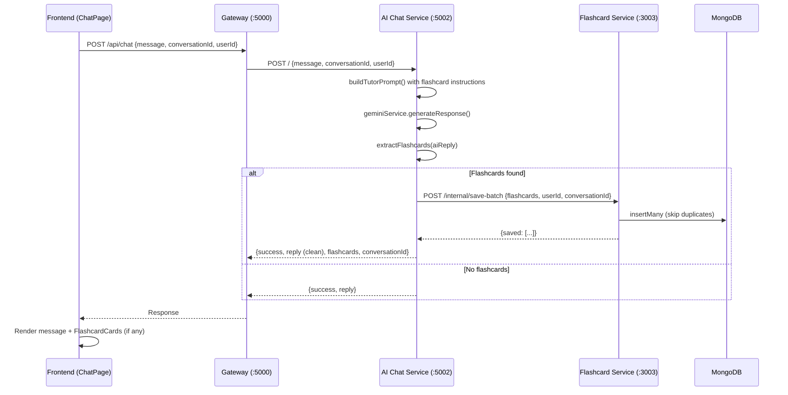

# Design Document: Chatbot Flashcard Generation

## Overview

Tính năng này mở rộng luồng chat hiện tại trong `ai-chat-service` để AI có thể tạo flashcard từ vựng inline trong phản hồi. Thay vì yêu cầu người dùng gọi endpoint `/generate` riêng biệt trên `flashcard-service`, hệ thống sẽ:

1. Bổ sung hướng dẫn vào system prompt để AI biết cách trả flashcard JSON khi được yêu cầu
2. Parse phản hồi AI để trích xuất flashcard JSON từ marker blocks
3. Validate và lưu flashcard vào MongoDB thông qua HTTP call đến `flashcard-service`
4. Trả về flashcard data trong chat response để frontend hiển thị inline

Thiết kế tận dụng tối đa code hiện có: module `flashcard-response-parser.js` đã tồn tại, flashcard model đã có sẵn các trường cần thiết, và frontend đã có pattern hiển thị message với markdown.

## Architecture



### Design Decisions

1. **Flashcard saving happens in ai-chat-service → flashcard-service via HTTP**: Giữ separation of concerns. ai-chat-service không trực tiếp access MongoDB của flashcard-service mà gọi qua internal API.

2. **Sử dụng module `flashcard-response-parser.js` đã có**: Module này đã implement đầy đủ logic extract và validate. Chỉ cần integrate vào chat controller.

3. **Prompt augmentation thay vì prompt replacement**: Khi detect yêu cầu flashcard, bổ sung instruction vào cuối prompt thay vì thay đổi toàn bộ system prompt. Giữ nguyên chức năng tutor.

4. **Graceful degradation**: Nếu flashcard-service không available hoặc save thất bại, chat vẫn trả về reply bình thường. Flashcard creation là best-effort.

## Components and Interfaces

### 1. Prompt Builder (Modified)

**File:** `ai-chat-service/src/utils/prompt-builder.js`

**Changes:** Thêm flashcard instruction block vào `buildTutorPrompt()` khi detect yêu cầu tạo flashcard.

```javascript
// New export
function detectFlashcardRequest(message) → boolean

// Modified function signature (unchanged externally)
function buildTutorPrompt({ message, level, history }) → string
// Internally appends FLASHCARD_INSTRUCTION when detectFlashcardRequest(message) is true
```

**FLASHCARD_INSTRUCTION constant:**
```
FLASHCARD GENERATION:
When the student asks you to create flashcards or vocabulary cards, generate them in this exact format:
- Wrap the JSON array in ```flashcards ... ``` markers
- Each flashcard must have: word, ipa, meaning, example
- Generate 3-5 flashcards per request unless specified otherwise
- Continue your normal teaching response before or after the flashcard block
```

### 2. Flashcard Response Parser (Existing)

**File:** `ai-chat-service/src/utils/flashcard-response-parser.js`

**Interface (no changes needed):**
```javascript
function extractFlashcards(aiResponse: string) → { cleanReply: string, flashcards: Array<{word, ipa, meaning, example}> }
function validateFlashcard(obj: object) → boolean
```

### 3. Chat Controller (Modified)

**File:** `ai-chat-service/src/controllers/chat.controller.js`

**Changes:** After receiving AI reply, call `extractFlashcards()`. If flashcards found, call flashcard-service to save, then return enriched response.

```javascript
async function handleChat(req, res, next) {
  // ... existing validation and AI call ...
  const reply = await geminiService.generateResponse(chatRequest);
  
  // NEW: Extract flashcards
  const { cleanReply, flashcards } = extractFlashcards(reply);
  
  // NEW: Save flashcards if any
  let savedFlashcards = [];
  if (flashcards.length > 0) {
    savedFlashcards = await saveFlashcards(flashcards, userId, conversationId);
  }
  
  // Return response with or without flashcards
  if (savedFlashcards.length > 0) {
    return res.json({ success: true, reply: cleanReply, flashcards: savedFlashcards, conversationId });
  }
  return res.json({ success: true, reply: cleanReply });
}
```

### 4. Flashcard Client (New)

**File:** `ai-chat-service/src/utils/flashcard-client.js`

**Purpose:** HTTP client to call flashcard-service internal API for saving flashcards.

```javascript
async function saveFlashcardsBatch({ flashcards, userId, conversationId }) → Array<Flashcard>
```

- Calls `POST http://localhost:3003/internal/save-batch`
- Handles timeout (5s) and errors gracefully
- Returns empty array on failure (logs error)

### 5. Flashcard Service - Internal Endpoint (New)

**File:** `flashcard-service/src/routes/flashcard.routes.js`

**New route:** `POST /internal/save-batch`

```javascript
router.post('/internal/save-batch', controller.saveBatchFromChat);
```

**Controller logic:**
- Receives `{ flashcards, userId, conversationId }`
- Assigns `_id`, `user_id`, `conversation_id`, `source: "chat-inline"` to each
- Checks for duplicate words per user (skip existing)
- Calls `flashcardRepository.createFlashcards()`
- Returns saved flashcards

### 6. Frontend - useChat Hook (Modified)

**File:** `frontend/src/hooks/useChat.js`

**Changes:** Handle `flashcards` field in API response, attach to message object.

```javascript
// Message type extended:
{ id, role, text, flashcards?: Array<{word, ipa, meaning, example}> }
```

### 7. Frontend - FlashcardInlineCard Component (New)

**File:** `frontend/src/components/ui/FlashcardInlineCard.jsx`

**Purpose:** Renders a single flashcard card inline in chat.

```jsx
function FlashcardInlineCard({ flashcard }) → JSX
// Displays: word (bold), ipa (italic), meaning, example
// Styled with distinct background, border, and vocabulary icon
```

### 8. Frontend - ChatMessage (Modified)

**File:** `frontend/src/components/ui/ChatMessage.jsx`

**Changes:** After rendering AI message text, render `FlashcardInlineCard` for each flashcard if present.

## Data Models

### Flashcard (Existing - No Changes)

Schema đã có đầy đủ các trường cần thiết:

| Field | Type | Description |
|-------|------|-------------|
| _id | String | Unique ID (generated with `createId('flashcard')`) |
| user_id | String | Owner user ID |
| conversation_id | String | Source conversation |
| word | String | Vocabulary word |
| ipa | String | IPA pronunciation |
| meaning | String | Vietnamese meaning |
| example | String | Example sentence |
| source | String | `"ai"` (from /generate) or `"chat-inline"` (from chat) |
| reviewed_at | Date | Last review timestamp |
| created_at | Date | Auto-generated |
| updated_at | Date | Auto-generated |

### Chat Response (Extended)

```typescript
// Normal response (unchanged)
{ success: true, reply: string }

// Response with flashcards (new)
{ success: true, reply: string, flashcards: Flashcard[], conversationId: string }

// Roleplay response (unchanged)
{ success: true, reply: string, goalProgress: GoalProgress }
```

### Internal Save Batch Request

```typescript
{
  flashcards: Array<{ word: string, ipa: string, meaning: string, example: string }>,
  userId: string,
  conversationId: string
}
```

### Flashcard Marker Format

The AI wraps flashcard JSON inside fenced code blocks with the language tag `flashcards`:

    Some teaching text here...
    
    ```flashcards
    [
      {
        "word": "acquire",
        "ipa": "/əˈkwaɪər/",
        "meaning": "đạt được, thu được",
        "example": "She acquired new skills during the internship."
      }
    ]
    ```
    
    More teaching text...

## Correctness Properties

*A property is a characteristic or behavior that should hold true across all valid executions of a system—essentially, a formal statement about what the system should do. Properties serve as the bridge between human-readable specifications and machine-verifiable correctness guarantees.*

### Property 1: Flashcard JSON Round-Trip

*For any* valid array of flashcard objects (each with non-empty string fields word, ipa, meaning, example), wrapping them in a ```flashcards marker block and passing to `extractFlashcards()` SHALL produce an equivalent array of flashcard objects with the same field values.

**Validates: Requirements 2.1, 2.5**

### Property 2: Validation Filtering Preserves Only Valid Items

*For any* array containing a mix of valid flashcard objects (all 4 required non-empty string fields) and invalid objects (missing fields, wrong types, empty strings), `extractFlashcards()` SHALL return exactly those items that have all 4 required fields as non-empty strings, and no others.

**Validates: Requirements 2.2, 2.3**

### Property 3: No Marker Yields Empty Array and Preserved Text

*For any* string that does not contain the pattern ` ```flashcards `, calling `extractFlashcards()` SHALL return an empty flashcards array and a cleanReply equal to the original input string.

**Validates: Requirements 2.4**

### Property 4: Clean Reply Contains No Marker Content

*For any* AI response string (with or without flashcard markers), the `cleanReply` returned by `extractFlashcards()` SHALL not contain any ` ```flashcards ` marker patterns.

**Validates: Requirements 4.1, 4.4**

### Property 5: Prompt Always Preserves Core Teaching Content

*For any* message input (whether it requests flashcards or not), the output of `buildTutorPrompt()` SHALL always contain the core SYSTEM_PROMPT teaching instructions.

**Validates: Requirements 1.4**

### Property 6: Flashcard Request Detection

*For any* message string containing at least one flashcard-related keyword (e.g., "tạo flashcard", "flashcard", "tạo từ vựng"), `detectFlashcardRequest()` SHALL return true. *For any* message string containing none of these keywords, it SHALL return false.

**Validates: Requirements 1.1**

### Property 7: Metadata Enrichment on Save

*For any* set of valid flashcards saved through the chat-inline flow with a given userId and conversationId, every resulting flashcard record SHALL have `user_id` equal to the provided userId, `conversation_id` equal to the provided conversationId, and `source` equal to `"chat-inline"`.

**Validates: Requirements 3.2**

### Property 8: Duplicate Word Skipping

*For any* user who already has a flashcard with word W, attempting to save a new flashcard with the same word W through the chat-inline flow SHALL not create a new record, and the total count of flashcards for that user with word W SHALL remain 1.

**Validates: Requirements 3.3**

## Error Handling

| Scenario | Behavior | User Impact |
|----------|----------|-------------|
| AI response has malformed JSON in marker | Parser skips invalid block, returns empty or partial flashcards | User sees chat reply normally, no flashcards shown for invalid block |
| Flashcard-service unavailable | Chat controller catches error, logs it, returns normal reply | User sees chat reply, no flashcards. No error shown. |
| Database write fails | Flashcard-service returns error, chat controller handles gracefully | Same as above |
| AI doesn't include markers despite request | Parser returns empty array | User sees normal AI reply without flashcard cards |
| Duplicate word detected | Flashcard-service skips duplicate silently | User may see fewer flashcards than AI generated (only new ones saved) |
| Network timeout to flashcard-service | 5s timeout, catch error, continue with normal reply | User sees chat reply without flashcards |

### Error Logging

All flashcard-related errors are logged with structured JSON:
- `[FLASHCARD_PARSE_ERROR]` — malformed JSON in AI response
- `[FLASHCARD_SAVE_ERROR]` — failed to save to flashcard-service
- `[FLASHCARD_CLIENT_TIMEOUT]` — flashcard-service didn't respond in time

## Testing Strategy

### Property-Based Tests (using fast-check with Jest)

The `ai-chat-service` already uses Jest. We'll add `fast-check` for property-based testing.

**Library:** `fast-check` (JavaScript PBT library)
**Configuration:** Minimum 100 iterations per property test
**Tag format:** `Feature: chatbot-flashcard-generation, Property {N}: {title}`

Property tests target the pure logic modules:
- `flashcard-response-parser.js` — Properties 1, 2, 3, 4
- `prompt-builder.js` — Properties 5, 6
- `flashcard-client.js` / save logic — Properties 7, 8 (with mocked DB)

### Unit Tests (Example-Based)

- Prompt builder includes flashcard instruction when request detected (1.2, 1.3)
- Chat controller returns correct response structure with flashcards (4.2)
- Chat controller returns existing format when no flashcards (4.3)
- Chat controller handles flashcard-service failure gracefully (3.4)
- FlashcardInlineCard renders all 4 fields (5.2)
- ChatMessage renders flashcard cards when present (5.1)
- ChatMessage renders normally when no flashcards (5.4)

### Integration Tests

- End-to-end: send flashcard request → verify flashcard saved in DB with correct metadata (3.1, 6.1)
- Verify chat-inline flashcards appear in GET /history (6.2)
- Verify FlashcardStudyPage shows both sources (6.3)

### Test File Locations

- `ai-chat-service/src/tests/flashcard-response-parser.test.js` — Properties 1-4
- `ai-chat-service/src/tests/prompt-builder-flashcard.test.js` — Properties 5-6
- `ai-chat-service/src/tests/chat-controller-flashcard.test.js` — Properties 7-8, unit tests
- `frontend/src/components/ui/__tests__/FlashcardInlineCard.test.jsx` — UI tests

