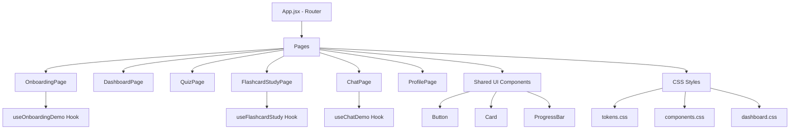

# Design Document: UI Interactivity Fix

## Overview

This design addresses the lack of interactive feedback across the English learning flashcard application's frontend. The application uses React 19 with React Router v7, Vite 8, and plain CSS with design tokens. The existing codebase already has the correct component structure and state management hooks (`useOnboardingDemo`, `useFlashcardStudy`, `useChatDemo`) — the primary issues are:

1. **Onboarding single-select steps** don't reflect the `level`/`exam` state back to the UI (the `selected` check only works for multi-select steps via `current.selected?.includes(option)`)
2. **Dashboard cards** lack click handlers and hover feedback on stat/recommendation cards
3. **Profile page** has no tooltip/hover interaction on weekly activity bars and no animated progress bars
4. **Consistent hover/focus states** are missing across interactive elements

The fix is primarily about wiring existing state to CSS classes correctly and adding missing CSS transitions, hover states, and keyboard accessibility attributes.

## Architecture

The application follows a page-based architecture with shared UI components:



**Key architectural decision:** All interactivity fixes are implemented through:
- Fixing state-to-class bindings in JSX (no new state management needed)
- Adding CSS rules for hover, focus, and transition states
- Adding ARIA attributes and keyboard event handlers for accessibility

No new libraries or architectural changes are required.

## Components and Interfaces

### Modified Hook: `useOnboardingDemo`

The hook already manages `level` and `exam` state correctly. The fix is in the `OnboardingPage` component which needs to check `demo.level`/`demo.exam` for single-select steps.

```javascript
// Current steps definition (broken for single-select):
{ title: '...', options: demo.levels, select: demo.setLevel, multi: false }

// Fixed: add `selected` field for single-select steps
{ title: '...', options: demo.levels, select: demo.setLevel, multi: false, selected: demo.level }
{ title: '...', options: demo.exams, select: demo.setExam, multi: false, selected: demo.exam }
```

The `selected` check in the template needs to handle both cases:
- Single-select: `current.selected === option`
- Multi-select: `current.selected?.includes(option)`

### Modified Component: `Card`

Add an `onClick` prop pass-through and ensure `card-interactive` class is applied when the card has click behavior or a navigation target.

### New CSS: Interactive States

```css
/* Global interactive element styles */
.option-card { cursor: pointer; transition: border-color 0.15s, background 0.15s, transform 0.1s; }
.option-card:hover { transform: translateY(-1px); border-color: var(--brand); }
.option-card:focus-visible { outline: 2px solid var(--brand); outline-offset: 2px; }

/* Weekly activity bar tooltip */
.week-bar-wrap { position: relative; }
.week-bar-wrap:hover .week-tooltip { opacity: 1; }
.week-tooltip { position: absolute; top: -24px; opacity: 0; transition: opacity 0.15s; }
```

### Modified Component: `ProgressBar`

Add CSS animation for the fill on mount using a `transition` on width.

## Data Models

No new data models are introduced. The existing state shapes are sufficient:

```typescript
// Onboarding state (already exists in useOnboardingDemo)
interface OnboardingState {
  step: number          // 0-3
  level: string | null  // single-select value
  exam: string | null   // single-select value
  goals: string[]       // multi-select array
  topics: string[]      // multi-select array
}

// Flashcard study state (already exists in useFlashcardStudy)
interface FlashcardStudyState {
  index: number
  flipped: boolean
  known: number
  unknown: number
  swipeDir: 'left' | 'right' | null
  finished: boolean
}

// Chat state (already exists in useChatDemo)
interface ChatState {
  messages: Array<{ id: number; role: 'user' | 'ai'; text: string }>
  input: string
  isTyping: boolean
  mode: 'knowledge' | 'roleplay'
}
```

## Correctness Properties

*A property is a characteristic or behavior that should hold true across all valid executions of a system — essentially, a formal statement about what the system should do. Properties serve as the bridge between human-readable specifications and machine-verifiable correctness guarantees.*

### Property 1: Single-select exclusivity

*For any* single-select step (level or exam) and *for any* sequence of option selections, exactly one option — the most recently clicked — shall be in the selected state, and all other options shall not be selected.

**Validates: Requirements 1.1, 1.2, 1.3**

### Property 2: Multi-select toggle

*For any* multi-select step (goals or topics) and *for any* option, clicking that option shall toggle its membership in the selection array — adding it if absent, removing it if present — without affecting other selections.

**Validates: Requirements 2.1, 2.2, 2.3**

### Property 3: Selection state persistence across navigation

*For any* onboarding step with selections made, navigating forward (Next) and then backward (Back) shall preserve the exact selection state that existed before navigation.

**Validates: Requirements 3.1, 3.2**

### Property 4: Quiz answer feedback correctness

*For any* quiz question and *for any* selected answer index, the feedback shall indicate "correct" if and only if the selected index equals the question's correct answer index, and exactly one answer option shall be in the selected state.

**Validates: Requirements 5.1, 5.2, 5.3**

### Property 5: Quiz continue guard

*For any* quiz state where no answer is selected (selected === null), invoking the continue action shall not advance the question index or modify the answers array.

**Validates: Requirements 5.4**

### Property 6: Flashcard flip toggle

*For any* flashcard state, invoking the flip action shall toggle the `flipped` boolean — if it was `false` it becomes `true`, and vice versa.

**Validates: Requirements 6.1**

### Property 7: Flashcard marking increments counter and advances

*For any* flashcard state where the study is not finished, marking a card as "known" shall increment the known counter by exactly 1 and advance to the next card, and marking as "don't know" shall increment the unknown counter by exactly 1 and advance to the next card.

**Validates: Requirements 6.2, 6.3**

### Property 8: Flashcard review completion invariant

*For any* complete sequence of know/don't-know decisions across all cards in a deck, the sum of the known count and unknown count shall equal the total number of cards, and the finished state shall be true.

**Validates: Requirements 6.4**

### Property 9: Chat mode toggle exclusivity

*For any* mode selection (knowledge or roleplay), the active mode shall be exactly the most recently selected mode, with no possibility of both or neither being active.

**Validates: Requirements 7.1, 7.2**

### Property 10: Chat message send appends to list

*For any* non-empty message string, sending it (either via form submit or quick action) shall append a message with role "user" and the given text to the message list, and the message list length shall increase by exactly 1.

**Validates: Requirements 7.3, 7.5**

## Error Handling

| Scenario | Handling |
|----------|----------|
| User clicks Continue with no quiz answer selected | Continue action is a no-op; question does not advance |
| User clicks option on a step that doesn't exist (step > 3) | Steps array falls back to `steps[0]` via nullish coalescing |
| Empty message submitted in chat | `send()` returns early if `text.trim()` is empty |
| Flashcard deck is empty | `useFlashcardStudy` shows finished state immediately (index 0 >= total 0) |
| Navigation to invalid route from dashboard card | React Router renders NotFoundPage |
| Keyboard activation on non-button elements | Elements use `role="button"` and `onKeyDown` handler for Enter/Space |

## Testing Strategy

### Unit Tests (Example-Based)

Unit tests cover specific rendering scenarios, edge cases, and integration points:

- Dashboard renders all recommendation cards with navigation links
- Dashboard stat cards have hover CSS class applied
- Profile page renders ProgressBar with correct percentage for each skill
- Profile weekly bars display tooltip on hover
- All interactive elements have `cursor: pointer` computed style
- All interactive elements show visible focus outline on keyboard focus
- Enter/Space key activates button-like elements
- AI response appears after typing indicator (async timer test)

### Property-Based Tests

Property-based tests verify universal correctness properties using **fast-check** (JavaScript PBT library).

**Configuration:**
- Minimum 100 iterations per property test
- Each test references its design document property via tag comment

**Tag format:** `Feature: ui-interactivity-fix, Property {number}: {property_text}`

**Properties to implement:**
1. Single-select exclusivity — generate random sequences of option clicks on level/exam steps
2. Multi-select toggle — generate random toggle sequences on goals/topics steps
3. Selection state persistence — generate selections then forward/back navigation
4. Quiz answer feedback correctness — generate random question/answer combinations
5. Quiz continue guard — generate quiz states with null selection
6. Flashcard flip toggle — generate random flip sequences
7. Flashcard marking — generate random know/don't-know sequences
8. Flashcard completion invariant — generate full review sequences
9. Chat mode exclusivity — generate random mode switch sequences
10. Chat message send — generate random non-empty strings as messages

### Test File Organization

```
app/frontend/src/__tests__/
├── onboarding.property.test.js    (Properties 1, 2, 3)
├── quiz.property.test.js          (Properties 4, 5)
├── flashcard.property.test.js     (Properties 6, 7, 8)
├── chat.property.test.js          (Properties 9, 10)
├── dashboard.test.js              (Unit tests)
├── profile.test.js                (Unit tests)
└── accessibility.test.js          (Unit tests for hover/focus/keyboard)
```

### Testing Dependencies Required

- `vitest` — test runner (aligns with Vite build tool)
- `@testing-library/react` — component rendering and interaction
- `fast-check` — property-based testing library
- `jsdom` — DOM environment for Vitest
