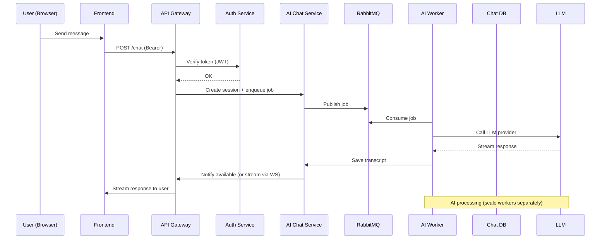
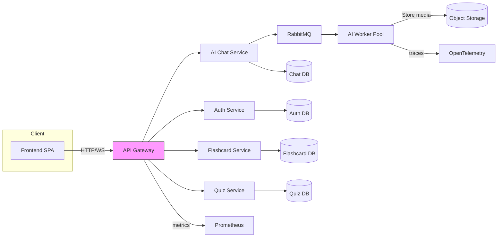

# ARCHITECTURE — AI Tutor English Learning System (MVP)

Phiên bản: MVP (focus)

Tài liệu này mô tả kiến trúc microservices tối giản cho MVP, bao gồm frontend, api gateway, auth, ai-chat, flashcard, quiz.

## Mục tiêu
- Hỗ trợ các user stories cốt lõi: conversation-based tutoring, flashcard review, quizzes.
- Tối giản dịch vụ để dễ phát triển và scale theo nhu cầu.

---

## Overview (services)
- **Frontend**: SPA (React/Vite) — giao diện người dùng, websocket client cho chat.
- **API Gateway** (`gateway`): ingress point, TLS, JWT validation, routing, websocket proxy.
- **Auth Service** (`auth-service`): quản lý user, đăng ký/đăng nhập, issue/refresh JWT, user basic profile.
- **AI Chat Service** (`ai-chat-service` + `ai-worker`): nhận chat request, quản lý session, enqueue jobs; worker gọi LLM provider và stream responses.
- **Flashcard Service** (`flashcard-service`): CRUD flashcards, SM-2 scheduling, user progress per card.
- **Quiz Service** (`quiz-service`): generate/serve quizzes, score evaluation, store attempts.

Mỗi service chịu trách nhiệm database riêng (DB-per-service) và API công khai nội bộ.

---

## Nhiệm vụ từng service (chi tiết)
- **Frontend**: UI pages: home, chat, flashcards, quiz, profile; auth flow (login/refresh), connect WS for AI chat.
- **API Gateway**: xác thực JWT (verify signature or call `auth-service`), rate limiting, routing REST/WS đến các service, central entry for TLS.
- **Auth Service**:
  - Endpoints: `/signup`, `/login`, `/token/refresh`, `/me`.
  - Stores: `users`, `password_hash`, `refresh_tokens`.
  - DB: PostgreSQL.
- **AI Chat Service**:
  - `ai-chat-service`: REST/WS entrypoints, persist chat sessions metadata, publish job to broker.
  - `ai-worker`: consume jobs, call external LLM (OpenAI / internal model), perform post-processing, store transcript.
  - DB: MongoDB (flexible transcript) or Postgres; use Redis for context cache.
- **Flashcard Service**:
  - CRUD card sets, scheduling algorithm (SM-2), endpoints for review sessions.
  - DB: Postgres.
- **Quiz Service**:
  - Generate quiz from content or AI, evaluate answers, store attempts and scores.
  - DB: Postgres.

---

## Database (per service)
- `auth-service`: PostgreSQL + Redis (session/revoke cache).
- `ai-chat-service`: MongoDB (transcripts) + Redis (context, rate-limit).
- `flashcard-service`: PostgreSQL.
- `quiz-service`: PostgreSQL.
- Object storage: MinIO (dev) / S3 (prod) for media assets.
- Message Broker: RabbitMQ (or Kafka when scaling) for async jobs and events.

---

## Communication flow

High level:
- Clients talk to `API Gateway` (HTTP + WebSocket). Gateway verifies JWT and forwards to services.
- Sync operations: Gateway -> target service via HTTP/gRPC.
- Async operations: service -> publish job/event to RabbitMQ -> worker or consumer service.

Mermaid sequence (chat example):

Mermaid architecture diagram:

---

## Logging & Tracing
- Use structured JSON logs (stdout) per service. Collect via Filebeat/Loki to central log store (ELK / Loki + Grafana).
- Instrument requests with OpenTelemetry traces; propagate context across services using trace headers.
- Expose `/metrics` for Prometheus; add application-specific metrics (chat latency, queue length, success rate).

---

## Monitoring & Alerts
- Prometheus + Grafana dashboards for:
  - Request rates, error rates per service
  - Queue depth (RabbitMQ)
  - AI worker processing latency
  - DB connection and replication lag
- Alerts via webhook/Slack for high error rates, queue backlog, CPU/memory spikes.

---

## CI/CD (MVP recommendations)
- Per-service GitHub Actions pipeline:
  1. Checkout, lint, run unit tests
  2. Build docker image, run integration smoke test
  3. Push image to registry
  4. Deploy to staging (Helm/K8s) and run e2e tests
  5. Manual approval to production
- Use feature branches + PR reviews; require green pipeline and `DEVELOPMENT_LOG.md` entry before merge (see `COPILOT_WORKFLOW_RULES.md`).

---

## Docker & Local dev
- Provide `docker-compose.yml` to run: gateway, auth, chat, worker, flashcard, quiz, Postgres instances, Mongo, Redis, RabbitMQ, MinIO.
- Keep service images small; each service includes `Dockerfile` and health/readiness endpoints.

---

## Scaling notes
- Stateless services: horizontal scale (replicas). Use HPA in K8s.
- AI workers: scale separately (resource profile: CPU/GPU). Use job autoscaler based on queue length.
- DBs: managed RDS or primary-replica; partition/shard when needed.

---

## Security
- Use TLS everywhere. Store secrets in vault/cluster secret manager.
- JWT short-lived access tokens + refresh tokens. Auth service performs revocation tracking.

---

## Artifacts
- File: [ARCHITECTURE.md](ARCHITECTURE.md)
- Added evidence should be linked in `DEVELOPMENT_LOG.md`.

---

Tài liệu này tập trung cho MVP; mở rộng (analytics, notifications, search) sẽ được thêm sau khi MVP ổn định.
