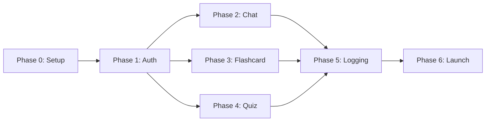

# IMPLEMENTATION ROADMAP — AI Tutor English Learning System (MVP)

Phiên bản: 0.1 (MVP)

Tài liệu này định nghĩa timeline, phase, deliverables, và dependencies cho triển khai MVP.

---

## Executive Summary

**Goal**: Ship MVP trong 12 tuần, validate core learning loop (Chat → Flashcard → Quiz → Progress).

**Approach**: Phased delivery, focus on one feature per phase, test frequently, integrate early.

**Team capacity**: Assume 2-3 devs (1 frontend, 1-2 backend).

---

## Phases Overview

| Phase | Name | Duration | Focus | Status |
|---|---|---|---|---|
| 0 | Setup & Infrastructure | 2 weeks | DevOps, DB, CI/CD, local docker-compose | Planning |
| 1 | Authentication | 2 weeks | Auth service, JWT, frontend login/signup | Planning |
| 2 | AI Chat (Core) | 3 weeks | Chat service, AI worker, streaming, session mgmt | Planning |
| 3 | Flashcard System | 2 weeks | Flashcard CRUD, SM-2 scheduling, review UI | Planning |
| 4 | Quiz System | 2 weeks | Quiz generation, scoring, explanation | Planning |
| 5 | Logging & Monitoring | 1 week | Centralized logging, Prometheus, dashboards | Planning |
| 6 | Polish & Launch | 1 week | Bug fixes, performance tuning, deployment | Planning |

**Total: ~13 weeks** (buffer for unknowns, testing)

---

## Phase 0: Setup & Infrastructure (Weeks 1–2)

### Objectives
- Set up dev environment (Docker Compose, databases, message broker).
- Initialize CI/CD pipelines (GitHub Actions stubs).
- Create base project structure and shared code.
- Establish coding standards & PR workflow.

### Deliverables
- `docker-compose.yml` with Postgres, Redis, RabbitMQ, MinIO.
- `.github/workflows/` templates per service.
- Base service scaffolds (NestJS / Express + health checks).
- Shared types package (`app/shared/types`).
- Project structure documented (`PROJECT_STRUCTURE.md`).
- Local dev guide (`docs/guides/local_dev_setup.md`).

### Key tasks
- [ ] Initialize Node/npm workspaces (optional, but recommended for monorepo).
- [ ] Set up `docker-compose.yml` for local dev with all services + databases.
- [ ] Create base service scaffolds using NestJS or Express boilerplate.
- [ ] Configure CI/CD stubs (GitHub Actions, pass lint/build only).
- [ ] Set up shared code packages (`app/shared`).
- [ ] Write setup documentation.

### Acceptance criteria
- `docker-compose up -d` spins all services successfully.
- Each service responds to `/health` and `/metrics` endpoints.
- Lint, build pass locally and in CI.
- Team can onboard new dev in < 30 min.

### Risks & Mitigations
- **Risk**: Docker Compose too complex initially.
  - **Mitigation**: Start with minimal services, add incrementally.
- **Risk**: CI/CD setup takes too long.
  - **Mitigation**: Use GitHub Actions templates, focus on per-service workflows.

---

## Phase 1: Authentication (Weeks 3–4)

### Objectives
- Build `auth-service` (signup, login, JWT generation, profile).
- Build API Gateway with JWT validation.
- Integrate frontend login/signup UI.
- Set up OAuth (Google, optional for MVP v0).

### Deliverables
- **Auth Service**:
  - POST `/signup` (email/password, Google).
  - POST `/login` → JWT access + refresh token.
  - POST `/token/refresh` → new access token.
  - GET `/me` → user profile.
  - Database schema (Postgres): users, refresh_tokens.
- **API Gateway**:
  - Route requests to backend services.
  - JWT validation middleware.
  - Rate limiting (simple: request count per IP).
  - CORS, TLS termination (dev: local cert).
- **Frontend**:
  - Login page with email/password form.
  - Signup page with email/password/level/goal.
  - Session management (JWT in localStorage, refresh logic).
  - Protected route wrapper.

### Architecture decisions
- **JWT strategy**: short-lived access tokens (15 min) + long-lived refresh tokens (7 days).
- **Password**: bcrypt with salt 12.
- **DB**: PostgreSQL for auth-service only (no need for NoSQL here).
- **Rate limiting**: simple in-memory map (scale to Redis later if needed).

### Key tasks
- [ ] Design auth schema and migrations.
- [ ] Implement auth service (NestJS with TypeORM + Postgres).
- [ ] Implement JWT guard middleware.
- [ ] Write unit tests (auth logic, JWT generation).
- [ ] Build gateway with proxy + JWT middleware.
- [ ] Implement frontend auth pages and context.
- [ ] Test auth flow end-to-end.

### Acceptance criteria
- User can signup with email/password.
- User can login and receive JWT.
- JWT is validated on each request to gateway.
- Frontend stores/refreshes token securely.
- Unit tests pass (>80% coverage on auth logic).

### Risks & Mitigations
- **Risk**: JWT secret management unclear.
  - **Mitigation**: Use env var, document in `.env.example`.
- **Risk**: Refresh token revocation not implemented.
  - **Mitigation**: MVP v0: simple in-memory set. Upgrade to DB revocation list later.

---

## Phase 2: AI Chat (Core Feature, Weeks 5–7)

### Objectives
- Build `ai-chat-service` (session management, REST + WebSocket endpoints).
- Build `ai-worker` (LLM calls, streaming, transcript storage).
- Integrate RabbitMQ for async job queue.
- Build frontend chat UI with real-time streaming.

### Deliverables
- **AI Chat Service**:
  - POST `/chat/session` → create session.
  - POST `/chat/message` → enqueue job, return job ID.
  - WS `/chat/stream/{jobId}` → stream response chunks.
  - GET `/chat/history/{sessionId}` → fetch past messages.
  - Database: MongoDB (flexible transcript schema) or Postgres + JSON field.
- **AI Worker**:
  - Consume jobs from RabbitMQ.
  - Call external LLM (OpenAI API or mock for dev).
  - Stream response back via callback / webhook to chat service.
  - Store transcript.
- **Frontend**:
  - Chat page with message input + streaming display.
  - Chat history sidebar.
  - Mode toggle (Knowledge vs Roleplay).
  - "Explain more" inline button.
- **Infrastructure**:
  - RabbitMQ docker-compose entry + queue setup.
  - Health check for worker job processing.

### Architecture decisions
- **Chat session**: stored per user, indexed by session ID.
- **Streaming**: WebSocket from frontend to gateway → chat service streams back as chunks.
- **Job queue**: RabbitMQ with dead-letter queue for failed jobs.
- **Transcript**: MongoDB for flexibility in schema evolution; fallback: Postgres JSONB.
- **LLM provider**: OpenAI (external API); mock for dev/testing.

### Key tasks
- [ ] Design chat schema and message format.
- [ ] Implement chat service (CRUD sessions, job publishing).
- [ ] Implement WebSocket streaming endpoint.
- [ ] Implement ai-worker (Python FastAPI, RabbitMQ consumer).
- [ ] Configure RabbitMQ queue + DLQ.
- [ ] Mock LLM responses for dev (don't hit API yet).
- [ ] Implement frontend chat UI with streaming.
- [ ] Write integration tests (session creation, message flow).

### Acceptance criteria
- User can create chat session.
- User sends message, receives AI response (mocked).
- Response streams to frontend in real-time.
- Chat history is persisted and retrievable.
- Worker job queue processes messages without blocking.
- System handles worker failures gracefully (retry, DLQ).

### Risks & Mitigations
- **Risk**: WebSocket latency or dropped connections.
  - **Mitigation**: Implement reconnect logic, heartbeat on client.
- **Risk**: LLM API calls slow / unreliable.
  - **Mitigation**: Timeout (30s), fallback response, cache common questions (later).
- **Risk**: Worker crashes lose messages.
  - **Mitigation**: RabbitMQ persistence, DLQ for failed jobs.

---

## Phase 3: Flashcard System (Weeks 8–9)

### Objectives
- Build `flashcard-service` (CRUD cards, SM-2 scheduling, progress tracking).
- Implement spaced repetition algorithm (SM-2).
- Integrate with chat (auto-generate flashcards from chat topics).
- Build frontend flashcard review UI.

### Deliverables
- **Flashcard Service**:
  - POST `/flashcards` → create card set.
  - GET `/flashcards/{setId}/review` → fetch due cards (SM-2 scheduling).
  - POST `/flashcards/{cardId}/review` → submit response (again/hard/good/easy), update schedule.
  - GET `/progress` → user progress summary.
  - Database: Postgres with cards, sets, user_progress tables.
- **Frontend**:
  - Flashcard page with swipe/buttons (Again/Hard/Good/Easy).
  - Progress dashboard (cards reviewed, streak, due tomorrow).
  - Auto-generate flashcards option (integrate with chat).
- **Infrastructure**:
  - None new (reuse existing DB setup).

### Architecture decisions
- **SM-2 algorithm**: standard spaced repetition (intervals: 1d, 3d, 1w, 2w, 1m).
- **Progress model**: stores review history (date, difficulty, interval).
- **Auto-generate**: frontend can POST chat topics → content-service suggests card templates.

### Key tasks
- [ ] Design flashcard schema (cards, sets, user_progress, review_history).
- [ ] Implement SM-2 scheduling algorithm.
- [ ] Build flashcard service (CRUD + scheduling endpoints).
- [ ] Implement frontend review UI with gesture support (swipe).
- [ ] Test SM-2 algorithm (generate schedules, verify intervals).
- [ ] Integrate flashcard creation from chat context.

### Acceptance criteria
- User can create and review flashcards.
- Cards are scheduled according to SM-2 (due times are accurate).
- Progress is tracked (cards reviewed, retention rate).
- Swipe UI is responsive and intuitive.

### Risks & Mitigations
- **Risk**: SM-2 algorithm implementation error → wrong schedule.
  - **Mitigation**: unit test against known SM-2 test cases.
- **Risk**: Auto-generation from chat is poor quality.
  - **Mitigation**: Manual review step, or AI generates + user approves before saving.

---

## Phase 4: Quiz System (Weeks 10–11)

### Objectives
- Build `quiz-service` (generate quizzes, evaluate answers, scoring).
- Build `content-service` (manage lesson content as quiz source).
- Implement scoring and feedback.
- Build frontend quiz UI.

### Deliverables
- **Content Service**:
  - GET `/lessons` → list lessons/topics.
  - GET `/lessons/{id}` → lesson details (text, examples, metadata).
  - Database: Postgres with lessons, topics, examples.
- **Quiz Service**:
  - POST `/quizzes/generate` → generate quiz from lesson/AI.
  - GET `/quizzes/{id}` → quiz questions.
  - POST `/quizzes/{id}/submit` → evaluate answers, return score + feedback.
  - GET `/attempts` → quiz history.
  - Database: Postgres with quizzes, questions, attempts, scores.
- **Frontend**:
  - Quiz page with question display + multiple choice/text input.
  - Result page with score, explanations.
  - Recommended quizzes section (daily suggestion).

### Architecture decisions
- **Quiz generation**: AI-generated questions + manually curated. Start with manual for MVP.
- **Scoring**: multiple choice = 1 point each, partial credit for multi-select.
- **Content source**: lessons from content-service, not hard-coded.

### Key tasks
- [ ] Design quiz schema (quizzes, questions, answers, attempts).
- [ ] Design lesson schema (content-service).
- [ ] Implement content-service (CRUD lessons).
- [ ] Implement quiz service (generate, submit, score, explain).
- [ ] Implement quiz generation logic (template-based for MVP, AI later).
- [ ] Build frontend quiz UI.
- [ ] Write scoring tests.

### Acceptance criteria
- User can view and take quizzes.
- Answers are scored correctly.
- User sees score and explanations after completion.
- Quiz history is tracked.

### Risks & Mitigations
- **Risk**: Quiz generation is poor quality.
  - **Mitigation**: MVP uses manually-curated questions. AI generation can be added later.

---

## Phase 5: Logging & Monitoring (Week 12)

### Objectives
- Set up centralized logging (ELK or Loki).
- Configure Prometheus metrics collection.
- Build Grafana dashboards for ops visibility.

### Deliverables
- **Centralized Logging**:
  - Filebeat/Loki configuration per service.
  - Central Elasticsearch or Loki instance in docker-compose.
- **Metrics**:
  - Prometheus scrape config for `/metrics` endpoints.
  - Prometheus instance in docker-compose.
- **Dashboards**:
  - Grafana dashboards: request rates, error rates, queue depth, DB performance.
- **Alerts** (optional for MVP):
  - Slack webhook for high error rates.

### Key tasks
- [ ] Configure structured JSON logging per service.
- [ ] Set up Prometheus + Grafana docker-compose.
- [ ] Implement `/metrics` endpoint in each service.
- [ ] Create sample dashboards.
- [ ] Test log aggregation and metric scraping.

### Acceptance criteria
- Logs appear in central log store within seconds.
- Prometheus scrapes all `/metrics` endpoints successfully.
- Grafana displays sample dashboards.
- Alert triggers correctly on high error rate (test scenario).

### Risks & Mitigations
- **Risk**: Logging overhead impacts performance.
  - **Mitigation**: Use async logging, sample logs if needed (e.g., 10% of requests).

---

## Phase 6: Polish & Launch (Week 13)

### Objectives
- Bug fixes from user testing.
- Performance tuning.
- Final documentation and deployment guide.
- Dry-run production deployment.

### Deliverables
- Issue fixes and closed PRs.
- Performance benchmarks (response times, DB queries).
- Deployment runbook (`docs/guides/deployment.md`).
- Load testing results (optional but recommended).

### Key tasks
- [ ] Collect feedback from internal testing.
- [ ] Fix critical bugs.
- [ ] Profile and optimize slow paths.
- [ ] Write deployment runbook.
- [ ] Conduct dry-run deployment.
- [ ] Update documentation.

### Acceptance criteria
- All critical bugs fixed.
- System meets performance SLA (e.g., chat response < 5s).
- Team can deploy to prod in < 30 min.

---

## Dependency & Sequencing

**Critical path**: Setup → Auth → Chat → Logging → Launch.

**Parallel opportunities**:
- Phase 3 & 4 can run concurrently (both depend on Phase 1).
- Frontend & backend development can overlap (stubs/mocks).

---

## Definition of Done (DoD)

Each phase must meet:
- [ ] Code reviewed and merged to main.
- [ ] Unit tests pass (>80% coverage).
- [ ] Integration tests pass.
- [ ] Entry in `DEVELOPMENT_LOG.md` with prompt, AI output, review, changes, result.
- [ ] Dockerfile builds successfully.
- [ ] Docker Compose integration tested.
- [ ] Documentation updated (`docs/`, README.md per service).
- [ ] Feature demo completed (video or screenshot in `docs/evidence/`).

---

## Risk Management

| Risk | Probability | Impact | Mitigation |
|---|---|---|---|
| LLM API latency / unavailability | Medium | High | Mock for dev; timeout + fallback; cache responses |
| Scope creep (new features mid-phase) | High | Medium | Lock scope; track as "Phase 7" items |
| Team member unavailable | Low | High | Documentation, pair programming, knowledge sharing |
| Database scaling issues | Low | Medium | Monitor query performance; optimize indexes early |
| WebSocket instability | Medium | Medium | Implement reconnect logic; use heartbeat |

---

## Budget & Resource Allocation

| Resource | Phase 0 | Phase 1 | Phase 2 | Phase 3 | Phase 4 | Phase 5 | Phase 6 |
|---|---|---|---|---|---|---|---|
| Backend dev (%) | 100 | 70 | 80 | 50 | 50 | 30 | 50 |
| Frontend dev (%) | 40 | 100 | 100 | 100 | 100 | 20 | 100 |
| DevOps/Platform (%) | 100 | 20 | 20 | 0 | 0 | 100 | 20 |

**Assumption**: 2–3 devs total; percentages sum to ~100–200% (overlap = pair programming or context switch).

---

## Success Metrics

**By end of MVP (Week 13)**:
- [ ] Users can sign up and authenticate.
- [ ] Users can chat with AI in Knowledge + Roleplay modes.
- [ ] Users can create and review flashcards.
- [ ] Users can take quizzes and see scores.
- [ ] System is logged and monitored.
- [ ] Deployable to production.
- [ ] Retention: >30% of users active 3+ days in first week.
- [ ] Performance: chat response <5s (p95), quiz load <2s.

---

## Post-MVP (Backlog)

These are NOT in MVP scope but can be added later:
- [ ] Voice chat / pronunciation scoring.
- [ ] Multiplayer / leaderboard.
- [ ] Advanced gamification (streak, badges).
- [ ] Email reminders / push notifications.
- [ ] Admin dashboard (advanced analytics).
- [ ] Native mobile apps.

---

## Document Version & History

| Version | Date | Author | Changes |
|---|---|---|---|
| 0.1 | 2026-05-16 | Architecture Team | Initial MVP roadmap |

---

*Last updated: 2026-05-16. Review and update this roadmap every 2 weeks during execution.*
