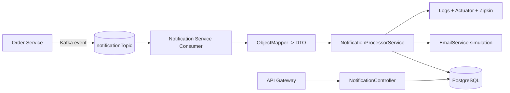
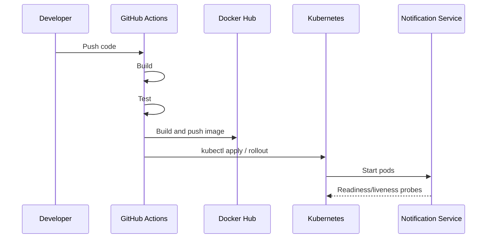

# Notification Service

Notification Service is the asynchronous notification component for the e-commerce backend. It consumes order events from Kafka, records notification history in PostgreSQL, and simulates email delivery.

## Responsibilities

The service receives JSON payloads from the `notificationTopic` Kafka topic, parses them into `OrderNotificationEvent`, persists the notification, and logs the processing lifecycle. It also exposes a small REST API for reading notification history.

## Folder Structure

```text
notification-service/
  src/main/java/vn/tt/practice/notificationservice/
    NotificationServiceApplication.java
    config/KafkaConsumerConfig.java
    consumer/OrderEventConsumer.java
    controller/NotificationController.java
    domain/NotificationRecord.java
    domain/NotificationRecordRepository.java
    domain/NotificationStatus.java
    dto/OrderNotificationEvent.java
    dto/NotificationResponse.java
    service/EmailService.java
    service/NotificationProcessorService.java
    service/NotificationQueryService.java
  src/main/resources/application.yml
  src/test/java/...
  Dockerfile
```

## Class Guide

- `NotificationServiceApplication` boots the Spring Boot application.
- `KafkaConsumerConfig` enables Kafka listeners and configures the consumer container factory.
- `OrderEventConsumer` subscribes to `notificationTopic`, deserializes JSON with `ObjectMapper`, and forwards the DTO to the processor.
- `OrderNotificationEvent` is the input DTO for Kafka messages.
- `NotificationProcessorService` owns the notification workflow: persist, simulate email, update status, and log outcomes.
- `EmailService` simulates outbound email delivery.
- `NotificationRecord` is the JPA entity persisted to PostgreSQL.
- `NotificationRecordRepository` provides persistence access.
- `NotificationQueryService` maps entities to read models for the API.
- `NotificationController` exposes REST endpoints for notification history.
- `NotificationResponse` is the API response DTO.

## Event Contract

```json
{
  "orderNumber": "ORD123",
  "message": "Order Placed Successfully"
}
```

## Microservice Flow



## Synchronous vs Asynchronous Communication

The core order-to-notification path is asynchronous. The Order Service publishes to Kafka, and the Notification Service consumes independently, which avoids blocking the order flow.

For read operations, the Notification Service exposes synchronous REST endpoints through the API Gateway. This keeps reads simple while preserving async event-driven processing for writes.

## Kafka Event Flow

1. Order Service publishes a JSON message to `notificationTopic`.
2. Notification Service consumes the message with `@KafkaListener`.
3. `ObjectMapper` deserializes the payload into `OrderNotificationEvent`.
4. The processor persists the notification and simulates email delivery.
5. Logs, metrics, and traces capture the lifecycle for observability.

## Service Discovery and Gateway Routing

The service registers with Eureka so other services and the API Gateway can discover it dynamically.

Typical routing pattern:

- `api-gateway` routes `/api/v1/notifications/**` to the Notification Service.
- Internal service-to-service calls should prefer Eureka service names instead of hard-coded hosts.

## Monitoring and Tracing

- Spring Boot Actuator exposes `health`, `info`, and `prometheus`.
- Prometheus scrapes metrics from `/actuator/prometheus`.
- Zipkin receives traces from Micrometer tracing.
- Health probes are configured for Kubernetes readiness and liveness.

## Deployment Flow



## CI/CD Workflow

The recommended pipeline has four stages:

1. Build the Maven project.
2. Run unit tests.
3. Build and push the Docker image.
4. Deploy to Kubernetes using `KUBECONFIG` from GitHub Secrets.

## Runtime Configuration

Important environment variables:

- `SPRING_DATASOURCE_URL`
- `SPRING_DATASOURCE_USERNAME`
- `SPRING_DATASOURCE_PASSWORD`
- `KAFKA_BOOTSTRAP_SERVERS`
- `EUREKA_SERVER_URL`
- `ZIPKIN_URL`

## Notes

The service is intentionally small and focused, but the structure supports adding retry policies, dead-letter topics, or an outbox pattern later without changing the public API.