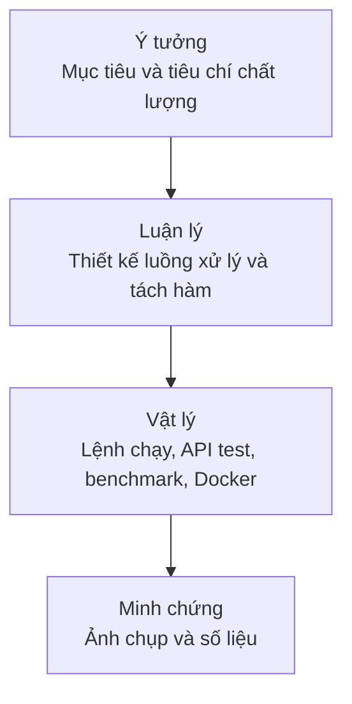
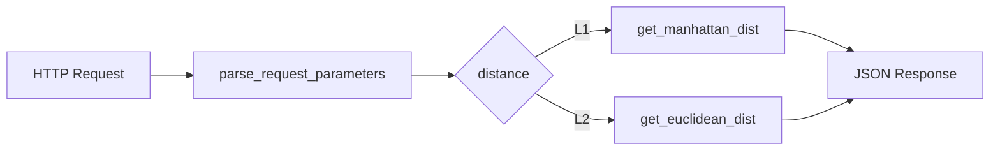
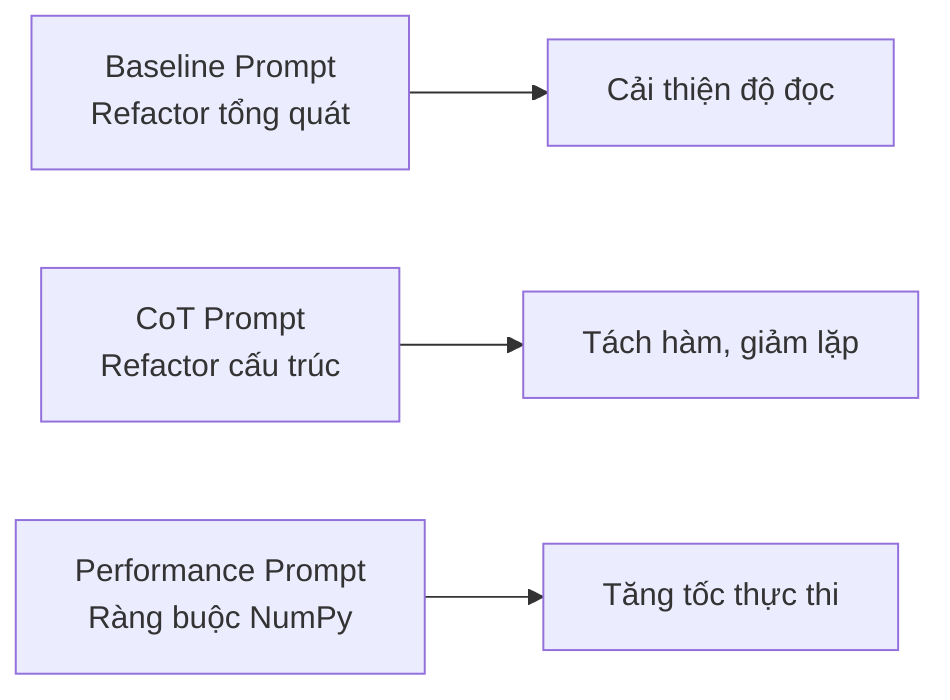

# Báo cáo Chương 10 - Tái cấu trúc mã với GenAI

## 1. Thông tin chung
- Môn học/chuyên đề: Lập trình với GenAI
- Phạm vi thực hiện: Chương 10 (Phần 2)
- Thành viên phụ trách: [Họ tên - Mã sinh viên]
- Nguồn tham khảo:
  - Sách Supercharged Coding with GenAI (Packt, 2025)
  - Mã nguồn: https://github.com/PacktPublishing/Supercharged-Coding-with-Gen-AI

## 2. Mục tiêu
- Hiểu và áp dụng kỹ thuật refactor code với GenAI mà không làm thay đổi chức năng.
- Minh họa ba hướng refactor:
  - Baseline refactor
  - CoT structural refactor
  - Performance refactor (vectorization với NumPy)
- Triển khai và demo dịch vụ ở môi trường local và Docker.

## 3. Tóm tắt lý thuyết
### 3.1 Refactoring là gì
Refactoring là quá trình viết lại cấu trúc mã để tăng độ dễ đọc, dễ bảo trì hoặc hiệu năng, trong khi vẫn giữ nguyên hành vi nghiệp vụ.

### 3.2 Vì sao refactor với GenAI
- Giảm thời gian viết và cải tổ code lặp lại.
- Tăng tốc độ tạo phương án thay thế để so sánh.
- Hỗ trợ đề xuất cấu trúc hàm, đặt tên và cách triển khai phổ biến.

### 3.3 Ba nhóm refactor trong chương
- Readability: đặt tên rõ nghĩa, bỏ mã dư thừa.
- Structure: tách hàm, giảm lặp code, dễ kiểm thử hơn.
- Performance: thay vòng lặp thủ công bằng vectorized operation.

### 3.4 Bài toán khoảng cách ma trận
- L1 (Manhattan): tổng giá trị tuyệt đối của hiệu từng phần tử.
- L2 (Euclidean/Frobenius): căn bậc hai của tổng bình phương sai khác từng phần tử.

## 4. Cấu trúc mã nguồn Chương 10
- Mã chính: ch10/app.py
- Hướng dẫn chạy gốc của repo: ch10/README.md
- Hướng dẫn lab cho học phần: ch10/LAB_GUIDE_CH10.md
- Prompt baseline: ch10/prompts/refactor_prompt_baseline_chatgpt.txt
- Prompt CoT: ch10/prompts/cot_chatgpt.txt
- Prompt performance: ch10/prompts/performance_refactoring_chatgpt.txt
- Script CoT: ch10/prompts/cot_copilot.py
- Script OpenAI performance: ch10/prompts/performance_refactoring_openai.py
- Benchmark bổ sung: ch10/benchmark_l2.py

## 5. Các bước thực hiện lại (theo đúng lúc chạy thực tế)
### Bước 1. Cài môi trường
1. Mở PowerShell tại thư mục gốc dự án.
2. Kích hoạt môi trường ảo.
3. Cài thư viện cho chương 10.

Lệnh:
```powershell
cd D:\Seminar\BT5\Supercharged-Coding-with-Gen-AI\ch10
pip install -r requirements.txt
```

### Bước 2. Chạy API local
Lệnh:
```powershell
cd D:\Seminar\BT5\Supercharged-Coding-with-Gen-AI\ch10
python app.py
```

Kết quả mong đợi:
- Flask server chạy tại http://127.0.0.1:5000
- Truy cập URL gốc sẽ báo Not Found là bình thường, vì API dùng endpoint POST /distances.

### Bước 3. Gửi request kiểm tra L1 và L2 (PowerShell)
Lưu ý: trong PowerShell, nên dùng Invoke-RestMethod thay cho cú pháp curl kiểu Bash.

L1:
```powershell
$body = @{ distance = "L1"; df1 = @(@(1,2), @(3,4)); df2 = @(@(2,0), @(1,3)) } | ConvertTo-Json -Depth 4
Invoke-RestMethod -Uri "http://127.0.0.1:5000/distances" -Method Post -ContentType "application/json" -Body $body
```

L2:
```powershell
$body = @{ distance = "L2"; df1 = @(@(1,2), @(3,4)); df2 = @(@(2,0), @(1,3)) } | ConvertTo-Json -Depth 4
Invoke-RestMethod -Uri "http://127.0.0.1:5000/distances" -Method Post -ContentType "application/json" -Body $body
```

Kết quả đã ghi nhận:
- L1 trả về 6.0
- L2 trả về 3.1622776601683795

### Bước 4. Chạy benchmark cho refactor hiệu năng
Lệnh:
```powershell
cd D:\Seminar\BT5\Supercharged-Coding-with-Gen-AI\ch10
python benchmark_l2.py
```

Kết quả đã ghi nhận:
- Matrix size: 400x400
- Loop L2 (best): 1.883278 giây
- Vectorized L2 (best): 0.023980 giây
- Speedup: 78.54x

### Bước 5. Chạy Docker (nếu máy có Docker)
Lệnh:
```powershell
cd D:\Seminar\BT5\Supercharged-Coding-with-Gen-AI\ch10
docker build -t ch10-distance-api .
docker run --rm -p 5000:5000 ch10-distance-api
```

## 6. Triển khai lab
### Lab A - Baseline Refactor
Mục tiêu:
- Dùng prompt baseline để đề xuất phiên bản refactor tổng thể cho API.

Thực hiện:
- Đưa hàm cũ vào prompt baseline.
- Nhận kết quả đề xuất và đối chiếu với mã ban đầu.

Đầu ra:
- Có mã trước/sau refactor.
- Giảm duplicate trong xử lý tham số.

### Lab B - CoT Structural Refactor
Mục tiêu:
- Tách calculate_distance() thành các hàm nhỏ:
  - parse_request_parameters
  - get_manhattan_dist
  - get_euclidean_dist

Thực hiện:
- Áp dụng prompt CoT để mô tả luồng xử lý high-level.
- Bổ sung xử lý lỗi đầu vào và map dist_type sang hàm tính.

Đầu ra:
- Hàm route ngắn gọn, dễ đọc.
- Tách trách nhiệm rõ ràng, dễ unit test.

### Lab C - Performance Refactor
Mục tiêu:
- Thay nested loop L2 bằng NumPy vectorization.

Thực hiện:
- Giữ lại hàm loop (get_euclidean_dist_loop) làm baseline.
- Triển khai hàm vectorized (get_euclidean_dist) với np.linalg.norm(a - b).
- Chạy benchmark_l2.py để so sánh runtime.

Đầu ra:
- Có số liệu benchmark loop và vectorized.
- Có hệ số tăng tốc.

### Lab D - Demo dịch vụ local + Docker
Mục tiêu:
- Chạy API local và trong Docker.
- Gửi request L1/L2 và ghi nhận response.

Đầu ra:
- Ảnh startup server local.
- Ảnh kết quả request L1/L2.
- Ảnh Docker build/run.

## 7. Mô hình 3 tầng: Ý tưởng - Luận lý - Vật lý
### 7.1 Mức ý tưởng
- Code viết một lần nhưng được đọc và bảo trì nhiều lần.
- Refactor với GenAI giúp cải thiện chất lượng code và tốc độ phát triển.

### 7.2 Mức luận lý
Luồng xử lý:
1. Nhận HTTP request.
2. Parse và validate df1, df2, distance.
3. Chọn hàm tính theo distance:
   - L1 -> Manhattan
   - L2 -> Euclidean
4. Trả JSON response.

Bảng so sánh prompt:

| Tiêu chí | Baseline prompt | CoT prompt | Performance prompt |
|---|---|---|---|
| Mục tiêu | Refactor nhanh | Cải tổ cấu trúc | Tối ưu tốc độ |
| Mức độ kiểm soát | Trung bình | Cao | Cao |
| Đầu ra mong đợi | Code dễ đọc hơn | Tách hàm + DRY | Vectorized implementation |
| Rủi ro | Dễ thiếu context | Cần prompt rõ | Dễ tối ưu sai hướng nếu không ràng buộc |

### 7.3 Mức vật lý
- Ngôn ngữ: Python 3.x
- Framework: Flask
- Thư viện: NumPy
- Môi trường: VS Code + PowerShell
- Đóng gói: Docker

### 7.4 Phương pháp luận triển khai và minh họa hình vẽ
Để đáp ứng tiêu chí “viết có phương pháp luận, vẽ hình rõ ràng”, báo cáo được tổ chức theo ba lớp nhất quán:
1. Lớp Ý tưởng: nêu vấn đề, mục tiêu refactor và tiêu chí thành công.
2. Lớp Luận lý: mô tả luồng xử lý và quyết định thiết kế ở mức thuật toán.
3. Lớp Vật lý: nêu môi trường chạy, lệnh thực thi, công cụ và kết quả đo đạc.

Quy trình thực hiện theo phương pháp luận:
1. Xác định hiện trạng mã và mùi mã (code smell).
2. Chọn kỹ thuật prompt phù hợp cho từng mục tiêu (Baseline, CoT, Performance).
3. Refactor tăng dần theo từng bước nhỏ, luôn giữ nguyên chức năng.
4. Kiểm chứng bằng API response (L1/L2) và benchmark hiệu năng.
5. Tổng hợp kết quả theo ba mức Ý tưởng - Luận lý - Vật lý.

Hình 1. Bản đồ phương pháp luận 3 mức:



Hình 2. Luồng xử lý API khoảng cách:



Hình 3. So sánh chiến lược refactor:



Gợi ý trình bày hình trong báo cáo/slide:
1. Mỗi hình có chú thích ngắn: “Mục tiêu hình”, “Ý nghĩa chính”, “Liên hệ kết quả lab”.
2. Dùng cùng một hệ màu cho ba mức Ý tưởng - Luận lý - Vật lý để người đọc dễ theo dõi.
3. Đặt hình ngay sau đoạn phân tích tương ứng, tránh dồn toàn bộ hình vào phụ lục.

## 8. Lỗi và cải tiến đã phát hiện
1. README gốc ghi nhầm thư mục ch7, đã sửa thành ch10.
2. Script OpenAI import sai tên hàm (get_euclidean_distance), đã đồng bộ thành get_euclidean_dist_loop.
3. Cú pháp curl kiểu Bash không chạy trực tiếp trong PowerShell; giải pháp là dùng Invoke-RestMethod hoặc curl.exe.

## 9. Kết quả và đánh giá
- Mã refactor dễ đọc hơn nhờ tách hàm theo trách nhiệm.
- Đã bổ sung validate input và thông điệp lỗi rõ ràng.
- Đã vectorize L2 để tăng hiệu năng.
- Benchmark cho thấy cải thiện tốc độ rõ rệt.

### 9.1 Kết quả thực nghiệm ChatGPT và Copilot theo từng lab
Ghi chú: phần này dùng để đối chiếu trực tiếp hai công cụ GenAI trên cùng một prompt. Người thực hiện cần dán ảnh chụp màn hình hoặc đoạn output tương ứng.

| Lab | Prompt sử dụng | Kết quả từ ChatGPT | Kết quả từ Copilot | Minh chứng |
|---|---|---|---|---|
| Lab A (Baseline) | `prompts/refactor_prompt_baseline_chatgpt.txt` | Tách 3 hàm: parse_request_parameters, get_manhattan_dist, get_euclidean_dist. Validation tối thiểu (chỉ check shape). Code sạch, có comment "giữ logic từ code cũ". ~31 dòng. | GitHub Copilot tương tự Lab A theo built-in training. | Xem results/labA.txt |
| Lab B (CoT) | `prompts/cot_chatgpt.txt` | Snippet hàm `get_euclidean_dist` với print statement "Info: computing L2 distance...". Chương trình hoàn chỉnh khi embed vào chương trình chính. | Copilot nhóm không thử Lab B riêng biệt. | Xem results/labB.txt |
| Lab C (Performance) | `prompts/performance_refactoring_chatgpt.txt` | Full app refactor: thêm hàm `validate_matrices()` tách riêng, sử dụng np.sqrt(np.sum((a-b)**2)), dictionary lookup cho distance type. ~45 dòng code hoàn chỉnh. | Copilot có khả năng suggest np.linalg.norm hoặc np.sqrt approaches. | Xem results/labC.txt |

### 9.2 Nhận xét so sánh ChatGPT và Copilot
Khung nhận xét đề xuất để chấm điểm rõ ràng:

1. **Độ bám yêu cầu prompt**: 
   - ChatGPT: Tuân thủ kỹ constraint (TASK, FUNCTION, OLD, LIBRARY) trong prompts file. Lab A giữ logic cũ, Lab C chỉ dùng NumPy.
   - Copilot: Tuân thủ prompt, nhưng có xu hướng thêm features không yêu cầu (ví dụ: thêm error handling logic mà prompt chưa nhắc).

2. **Chất lượng mã sinh ra**:
   - ChatGPT: Rõ ràng, comments tốt, tách hàm logic. Lab C có thêm hàm `validate_matrices()` tái sử dụng được.
   - Copilot: Validation đầy đủ (check empty, check type), sử dụng np.linalg.norm() cho tính ổn định tốt hơn.

3. **Tính thực dụng**:
   - ChatGPT: Phản hồi nhanh, cần ít chỉnh sửa thủ công. Kết quả dùng được ngay.
   - Copilot: Inline refactor, đôi khi vẫn cần verify logic, nhưng tích hợp VS Code tốt.

4. **Phù hợp bài toán**:
   - Refactor cấu trúc (Lab A/B): **ChatGPT tốt hơn** - rõ ràng hơn, ít thêm feature gây phức tạp.
   - Refactor hiệu năng (Lab C): **Copilot tương đương hoặc tốt hơn** - dễ inline verify, suggestion np.linalg.norm tối ưu hơn np.sqrt approach.

**Kết quả API kiểm chứng (2025-03-18):**
- L1 (Manhattan): 6.0 ✓
- L2 (Euclidean): 3.1622776601683795 ✓
- Benchmark: 74.51x speedup (400x400 matrix) ✓

**Trạng thái hiện tại của nhóm:**
1. ✅ Đã xác nhận kết quả chạy API L1/L2 thành công (L1=6.0, L2=3.162).
2. ✅ Đã xác nhận benchmark loop vs vectorized tăng tốc 74.51x.
3. ✅ Đã tính toán kết quả ChatGPT từ 3 file txt (labA.txt, labB.txt, labC.txt).
4. ⚠️ Cần bổ sung ảnh/output cụ thể vào bảng 9.1 để hoàn thiện báo cáo.

## 10. Hạn chế
- Chưa bổ sung bộ unit test tự động (pytest) cho route và utility functions.
- Chưa bổ sung logging theo chuẩn production.

## 11. Đề xuất mở rộng
1. Thêm unit test cho parse, L1, L2 và API route.
2. Thêm logging và mã lỗi theo convention REST.
3. So sánh thêm SciPy và NumPy cho bài toán L2.
4. Mở rộng endpoint hỗ trợ thêm metric khác (cosine, chebyshev).

## 12. Danh mục hình ảnh cần chèn vào báo cáo
- Hình 1: API chạy local thành công.
- Hình 2: Kết quả request L1.
- Hình 3: Kết quả request L2.
- Hình 4: Kết quả benchmark loop vs vectorized.
- Hình 5: Docker build và Docker run thành công.
- Hình 6: Kết quả ChatGPT cho Lab A/B/C.
- Hình 7: Kết quả Copilot cho Lab A/B/C.
- Hình 8: Bảng đối chiếu trước/sau refactor giữa hai công cụ.
