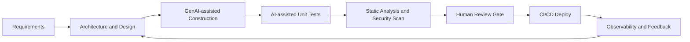

# BÁO CÁO CHƯƠNG 16

## Thông tin sinh viên

- Họ và tên:
- Mã sinh viên:
- Nhóm:
- Môn học:
- Bài tập: Bài 06 - Production GenAI
- Phân công: Chương 16 - Architecture, Design, and the Future

---

## 1. Mục tiêu chương

Chương 16 tổng kết bức tranh tổng quan về sự thay đổi của kỹ nghệ phần mềm khi GenAI phát triển nhanh. Trong phạm vi báo cáo này, mục tiêu là:

- Tóm tắt những luận điểm chính của chương 16.
- Chuyển hóa thành khung thực thi cho doanh nghiệp/dự án.
- Trình bày theo 3 mức: ý tưởng, luận lý, vật lý.
- Đề xuất roadmap ứng dụng GenAI cho đội phát triển phần mềm.

## 2. Nội dung cốt lõi của chương 16

### 2.1. Sự trỗi dậy nhanh của GenAI

- Từ đột phá AlexNet (2012), đến Transformer (2017), và LLM (GPT-1 -> GPT-4), AI đã chuyển từ nghiên cứu sang giá trị ứng dụng rộng rãi.
- ChatGPT/Copilot đã làm giao diện tương tác AI trở nên đại chúng, giảm mạnh rào cản kỹ thuật.
- Hệ quả trực tiếp: tốc độ phát triển phần mềm tăng, vai trò của kỹ sư phần mềm thay đổi.

### 2.2. Kinh tế học của việc viết phần mềm nhanh hơn

- Khi chi phí tạo mã giảm, nguồn cung phần mềm tăng.
- Tự động hóa testing/documentation làm giảm tổng chi phí vòng đời.
- Nhu cầu phần mềm mới tăng vì doanh nghiệp có thể giải bài toán trước đây bị xem là "không đủ ngân sách".

### 2.3. Dịch chuyển vai trò lập trình viên

- GenAI hỗ trợ mạnh cho coding task cấp hàm/lớp: code, test, docstring, refactor.
- Vai trò senior tăng giá trị ở các tầng: kiến trúc, tích hợp, quality gate, governance.
- Junior được tăng tốc học tập, nhưng cần bổ sung năng lực tư duy hệ thống để tránh bị thay thế ở công việc lặp lại.

### 2.4. Liên hệ SWEBOK

Theo SWEBOK, GenAI hiện đạt hiệu quả cao nhất ở:

- Software Construction
- Software Testing

Đồng thời hỗ trợ gián tiếp:

- Software Maintenance
- Software Quality

Các miền cần con người dẫn dắt mạnh:

- Requirements, Architecture, Design, Operations, Security, Management, Economics.

### 2.5. GenAI có thay đổi ngôn ngữ lập trình?

- Trạng thái hiện tại: AI là trợ lý viết code trong ngôn ngữ hiện hữu.
- Xu hướng tiếp theo: tăng cường giao tiếp bằng ngôn ngữ tự nhiên/pseudocode.
- Hạn chế: mơ hồ của ngôn ngữ tự nhiên và khó khăn trong biểu diễn lặp (iteration), ràng buộc phi chức năng, và điều kiện biên.

### 2.6. Tương lai gần và xa

- Ngắn hạn (1-3 năm): tăng độ chính xác, tích hợp IDE sâu hơn, nâng cao năng suất.
- Dài hạn (>=5 năm): dịch chuyển từ artifact mức cao (yêu cầu, UML, Figma) sang code ban đầu.
- Vẫn cần con người cho architecture, validation, compliance, và trách nhiệm pháp lý.

### 2.7. Rủi ro và governance

- Rủi ro bản quyền dữ liệu huấn luyện.
- Rủi ro explainability: không rõ ai/agent nào tạo đoạn mã lỗi.
- Rủi ro compliance trong lĩnh vực regulated (y tế, ngân hàng, giao thông).
- Yêu cầu mới: audit trail, model card, policy về dữ liệu và review gate.

---

## 3. Phân tích theo 3 mức: Ý tưởng - Luận lý - Vật lý

## 3.1. Mức Ý tưởng (Conceptual)

Câu hỏi trung tâm:

- Tổ chức dùng GenAI để tạo lợi thế cạnh tranh gì?
- Mục tiêu là tăng tốc, tăng chất lượng, hay giảm chi phí?
- Mức độ chấp nhận rủi ro đến đâu?

Đề xuất thông điệp ý tưởng:

- "GenAI không thay thế toàn bộ software engineering; nó tái phân bổ lại giá trị công việc."
- "Con người dịch chuyển lên tầng thiết kế, tích hợp, và quản trị rủi ro."

## 3.2. Mức Luận lý (Logical)

Thiết kế quy trình logic khi đưa GenAI vào SDLC:

Nguyên tắc luận lý:

- Human-in-the-loop tại các điểm quyết định quan trọng.
- AI output phải đi qua quality gate như code thủ công.
- Tách biệt rõ artifact do AI tạo và artifact đã được human-approved.

## 3.3. Mức Vật lý (Physical)

Ánh xạ vào stack công cụ cụ thể:

- IDE: VS Code + GitHub Copilot/ChatGPT.
- SCM: GitHub/GitLab với branch protection.
- CI: GitHub Actions/Jenkins.
- Quality: pytest, coverage, ruff/flake8, bandit, SAST.
- Observability: logging tập trung + metrics + alerting.

Mẫu gate tối thiểu trước merge:

- Unit test pass >= 95% số test hiện có.
- Coverage module mới >= 80%.
- Không có high-severity security finding.
- Có issue link và mô tả nguồn gốc prompt/agent.

---

## 4. Code minh họa (tóm tắt)

Trong thư mục `code_demo/`, em xây dựng script đánh giá quyền ưu tiên ứng dụng GenAI theo các yếu tố:

- Độ phức tạp kiến trúc
- Mức độ regulatory
- Mức độ legacy
- Năng lực đội ngũ

Đầu ra:

- Mức ưu tiên từng hạng mục SWEBOK
- Danh sách governance gate để bắt buộc thêm vào quy trình
- Khuyến nghị chiến lược nhân sự (junior/senior/domain expert)

Điều này minh họa trực tiếp thông điệp Chương 16: GenAI là bộ tăng tốc, không phải bộ tự động thay thế hoàn toàn.

---

## 5. Đề xuất triển khai cho doanh nghiệp (mẫu 12 tuần)

### Giai đoạn 1 (Tuần 1-4): Pilot có kiểm soát

- Chọn 1 dự án nội bộ quy mô vừa.
- Áp dụng GenAI cho construction + testing.
- Đặt baseline metric: lead time, defect density, review time.

### Giai đoạn 2 (Tuần 5-8): Chuẩn hóa quy trình

- Ban hành prompt guideline và coding standard cho AI-assisted code.
- Thêm audit trail vào PR template.
- Đào tạo senior dev về architecture review cho AI-generated changes.

### Giai đoạn 3 (Tuần 9-12): Mở rộng có điều kiện

- Mở rộng sang 2-3 team khác.
- Theo dõi ROI và rủi ro compliance.
- Điều chỉnh ma trận quyết định theo dữ liệu thực tế.

---

## 6. Đánh giá cá nhân và kết luận

- GenAI tạo ra bước nhảy năng suất thật sự trong coding task cấp thấp-đến-trung.
- Giá trị chiến lược của software engineer sẽ dịch chuyển lên architecture, design, integration, governance.
- Tổ chức thành công sẽ là tổ chức biến GenAI thành một năng lực hệ thống (process + tooling + governance), không chỉ là một plugin IDE.

Kết luận:

Chương 16 cho thấy tương lai software engineering là sự kết hợp giữa trí tuệ con người ở tầng thiết kế và sức mạnh GenAI ở tầng thi hành. Người chiến thắng không phải là bên có model lớn nhất, mà là bên có quy trình tin cậy, có kiểm soát rủi ro, và học nhanh hơn.

---

## 7. Tài liệu tham khảo

- Packt, Supercharged Coding with GenAI, Chapter 16.
- SWEBOK v4 (IEEE Computer Society).
- Gartner (2023), AI in Software Engineering Hype Cycle.
- KPMG (2023), Generative AI and software engineering productivity.
