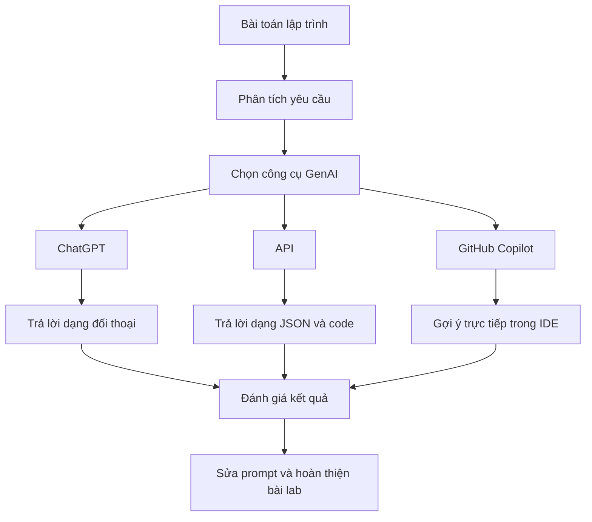
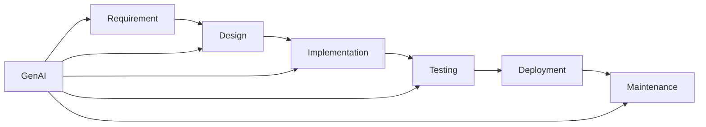
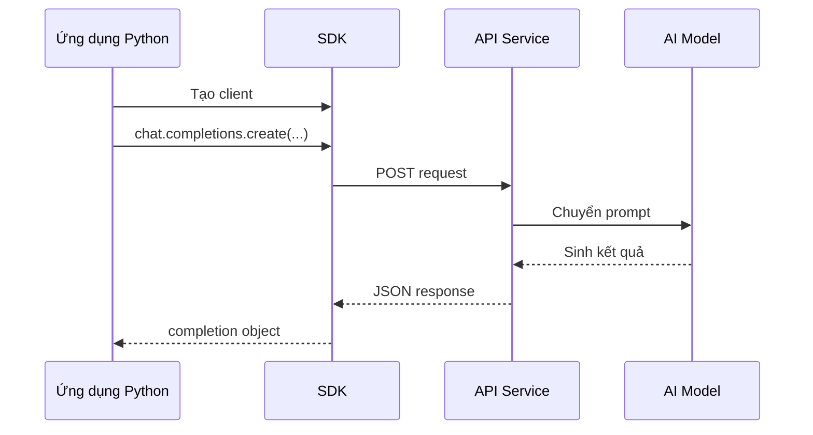
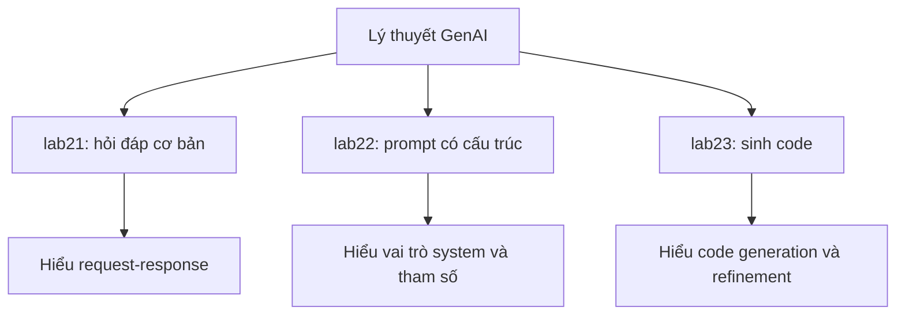

# Báo Cáo Lab Thực Hành 2: Cơ Sở Lập Trình Với GenAI

## 1. Mục tiêu và phương pháp luận

Báo cáo này được viết theo đúng yêu cầu của học phần Cơ sở lập trình với GenAI, gồm 5 chủ đề chính:

1. Từ tự động hóa đến chu kỳ phát triển phần mềm hoàn chỉnh.
2. Làm việc với API OpenAI.
3. Sử dụng GitHub Copilot với PyCharm, VS Code và Jupyter Notebook.
4. Các phương pháp tốt nhất để hỏi đáp với ChatGPT.
5. Các phương pháp tốt nhất để hỏi đáp với API OpenAI và GitHub Copilot.

Báo cáo sử dụng ba mức phân tích:

- Mức ý tưởng: giải thích vai trò, giá trị và mục đích của công nghệ.
- Mức luận lý: mô tả cách tổ chức quy trình, prompt, dữ liệu vào và dữ liệu ra.
- Mức vật lý: chỉ ra công cụ, file, lệnh chạy, API và bài lab minh họa cụ thể.

Sơ đồ tổng quát của phương pháp học và thực hành với GenAI:

Các tệp lab liên quan trong workspace:

- [Supercharged-Coding-with-Gen-AI/ch2/labs/lab21.py](Supercharged-Coding-with-Gen-AI/ch2/labs/lab21.py)
- [Supercharged-Coding-with-Gen-AI/ch2/labs/lab22.py](Supercharged-Coding-with-Gen-AI/ch2/labs/lab22.py)
- [Supercharged-Coding-with-Gen-AI/ch2/labs/lab23.py](Supercharged-Coding-with-Gen-AI/ch2/labs/lab23.py)
- [Supercharged-Coding-with-Gen-AI/ch2/solutions/lab21.py](Supercharged-Coding-with-Gen-AI/ch2/solutions/lab21.py)
- [Supercharged-Coding-with-Gen-AI/ch2/solutions/lab22.py](Supercharged-Coding-with-Gen-AI/ch2/solutions/lab22.py)
- [Supercharged-Coding-with-Gen-AI/ch2/solutions/lab23.py](Supercharged-Coding-with-Gen-AI/ch2/solutions/lab23.py)
- [Supercharged-Coding-with-Gen-AI/ch2/code_samples/openai_request.py](Supercharged-Coding-with-Gen-AI/ch2/code_samples/openai_request.py)
- [Supercharged-Coding-with-Gen-AI/ch2/labs/import openai.py](Supercharged-Coding-with-Gen-AI/ch2/labs/import%20openai.py)

## 2. Từ Tự động hóa đến Chu kỳ Phát triển Phần mềm Hoàn chỉnh: Cơ hội hiện tại cho GenAI

### Tóm tắt lý thuyết

GenAI không chỉ là công cụ tự động hóa thao tác đơn lẻ, mà đang trở thành thành phần hỗ trợ xuyên suốt toàn bộ chu kỳ phát triển phần mềm. Trong SDLC, GenAI có thể tham gia vào giai đoạn phân tích yêu cầu, thiết kế, lập trình, kiểm thử, debug và tài liệu hóa. Giá trị cốt lõi của GenAI nằm ở việc rút ngắn thời gian xử lý tri thức và tăng tốc độ lặp lại các công việc có cấu trúc.

Sơ đồ SDLC có hỗ trợ GenAI:

### Phân tích theo ba mức

- Ý tưởng: GenAI là bộ tăng cường năng suất cho lập trình viên, không phải sự thay thế hoàn toàn.
- Luận lý: GenAI tham gia quy trình theo vòng lặp yêu cầu, prompt, sinh kết quả, đánh giá, hiệu chỉnh.
- Vật lý: sự tham gia này được hiện thực bằng chat tool, API và plugin IDE như GitHub Copilot.

### Lab minh họa

- [Supercharged-Coding-with-Gen-AI/ch2/labs/lab21.py](Supercharged-Coding-with-Gen-AI/ch2/labs/lab21.py) minh họa mức cơ bản nhất: đặt câu hỏi cho mô hình và nhận về phần giải thích bài toán.
- [Supercharged-Coding-with-Gen-AI/ch2/labs/lab23.py](Supercharged-Coding-with-Gen-AI/ch2/labs/lab23.py) minh họa mức cao hơn: dùng GenAI để hoàn thiện mã nguồn dựa trên chữ ký hàm.

## 3. Làm việc với API OpenAI

### Tóm tắt lý thuyết

Làm việc với API OpenAI là bước chuyển từ hỏi đáp thủ công sang tự động hóa có lập trình. Thay vì nhập prompt trên giao diện chat, lập trình viên tạo request HTTP hoặc dùng SDK để truyền vào `model`, `messages`, `temperature`, `max_tokens` và nhận lại response có cấu trúc. Cách tiếp cận này rất quan trọng vì nó cho phép tích hợp AI vào script, ứng dụng và quy trình xử lý lớn hơn.

Sơ đồ luồng gọi API:

### Phân tích theo ba mức

- Ý tưởng: API biến AI thành tài nguyên có thể lập trình và tái sử dụng.
- Luận lý: cần tổ chức request theo cấu trúc, tách đầu vào, tham số và cách đọc đầu ra.
- Vật lý: code được đặt trong script Python, API key được đặt trong biến môi trường, client gọi endpoint và in kết quả.

### Lab minh họa

- [Supercharged-Coding-with-Gen-AI/ch2/code_samples/openai_request.py](Supercharged-Coding-with-Gen-AI/ch2/code_samples/openai_request.py) là mẫu request HTTP cơ bản.
- [Supercharged-Coding-with-Gen-AI/ch2/labs/lab21.py](Supercharged-Coding-with-Gen-AI/ch2/labs/lab21.py) là ví dụ gọi chat completion có prompt đơn giản.
- [Supercharged-Coding-with-Gen-AI/ch2/labs/lab22.py](Supercharged-Coding-with-Gen-AI/ch2/labs/lab22.py) bổ sung `system`, `temperature`, `max_tokens` và đọc `usage`.
- [Supercharged-Coding-with-Gen-AI/ch2/labs/import openai.py](Supercharged-Coding-with-Gen-AI/ch2/labs/import%20openai.py) là biến thể thực tế sử dụng API tương thích OpenAI của dacdev.com qua `base_url`.

## 4. Sử dụng GitHub Copilot với PyCharm, VS Code và Jupyter Notebook

### Tóm tắt lý thuyết

GitHub Copilot là công cụ gợi ý mã nguồn theo ngữ cảnh, tích hợp trực tiếp vào IDE. Khác với API chat, Copilot đọc tên hàm, comment, file đang mở và các file liên quan để đưa ra gợi ý ngay trong lúc lập trình. Mỗi môi trường phát triển đem lại một lợi thế riêng.

Bảng so sánh môi trường:

| Môi trường | Điểm mạnh | Trường hợp phù hợp |
|---|---|---|
| VS Code | Nhanh, dễ thử nghiệm, tích hợp chat và plugin tốt | Lab, script, bài tập ngắn |
| PyCharm | Mạnh về phân tích code và refactor | Dự án Python có cấu trúc rõ ràng |
| Jupyter Notebook | Kết hợp code và giải thích theo từng bước | Minh họa lý thuyết, thử nghiệm, báo cáo |

### Phân tích theo ba mức

- Ý tưởng: Copilot là trợ lý lập trình theo ngữ cảnh, giúp tăng tốc độ viết và sửa code.
- Luận lý: chat được dùng để trao đổi ý tưởng, còn Copilot được dùng ngay tại vị trí cần viết mã.
- Vật lý: Copilot hoạt động trong editor, dựa trên context file, comment, function signature và history chỉnh sửa.

### Lab minh họa

- [Supercharged-Coding-with-Gen-AI/ch2/labs/lab23.py](Supercharged-Coding-with-Gen-AI/ch2/labs/lab23.py) phù hợp để minh họa cách Copilot có thể đề xuất phần thân hàm từ chữ ký `print_fibonacci_sequence(n: int) -> None`.
- [Supercharged-Coding-with-Gen-AI/ch2/labs/lab22.py](Supercharged-Coding-with-Gen-AI/ch2/labs/lab22.py) cho thấy lợi ích của việc kết hợp IDE và AI khi cần sửa prompt, tham số và cách in kết quả.

## 5. Các phương pháp tốt nhất để hỏi đáp với ChatGPT

### Tóm tắt lý thuyết

ChatGPT hiệu quả nhất khi prompt được tổ chức có chủ đích. Prompt chất lượng cao cần thể hiện rõ vai trò của mô hình, mục tiêu bài toán, ràng buộc về ngôn ngữ và dạng đầu ra. Nếu prompt mơ hồ, kết quả sẽ dễ lệch mục tiêu và khó tái sử dụng.

Khung prompt đề nghị:

1. Vai trò của mô hình.
2. Bài toán cần giải.
3. Dữ liệu vào.
4. Ràng buộc về độ dài, phong cách, ngôn ngữ.
5. Dạng đầu ra mong muốn.

Sơ đồ cải tiến prompt:

### Phân tích theo ba mức

- Ý tưởng: prompt là cách diễn đạt bài toán cho AI.
- Luận lý: prompt tốt phải có vai trò, mục tiêu, ràng buộc và tiêu chí đầu ra.
- Vật lý: prompt được viết trong giao diện chat, terminal hoặc script và cần được lặp lại để cải tiến kết quả.

### Lab minh họa

- [Supercharged-Coding-with-Gen-AI/ch2/labs/lab21.py](Supercharged-Coding-with-Gen-AI/ch2/labs/lab21.py) là prompt cơ bản để giải thích FizzBuzz.
- [Supercharged-Coding-with-Gen-AI/ch2/labs/lab22.py](Supercharged-Coding-with-Gen-AI/ch2/labs/lab22.py) thể hiện prompt tốt hơn nhờ có `system role` và ràng buộc bối cảnh.
- [Supercharged-Coding-with-Gen-AI/ch2/labs/lab23.py](Supercharged-Coding-with-Gen-AI/ch2/labs/lab23.py) cho thấy prompt có cấu trúc rõ ràng sẽ sinh code tốt hơn.

## 6. Các phương pháp tốt nhất để hỏi đáp với API OpenAI và GitHub Copilot

### Tóm tắt lý thuyết

Khi làm việc với API và Copilot, prompt không còn là câu hỏi tự do mà trở thành một phần của hệ thống kỹ thuật. Với API, prompt cần ổn định, có thể kiểm thử và xử lý tự động. Với Copilot, chất lượng gợi ý phụ thuộc rất mạnh vào context code, tên hàm, comment và kiểu dữ liệu.

Bảng tổng hợp:

| Tiêu chí | ChatGPT | API OpenAI | GitHub Copilot |
|---|---|---|---|
| Kiểu tương tác | Đối thoại | Lập trình được | Gợi ý trong IDE |
| Đơn vị prompt | Câu hỏi | Cấu trúc request | Comment, code context, function signature |
| Mục tiêu | Trả lời và giải thích | Tích hợp hệ thống | Tăng tốc độ viết mã |
| Yêu cầu kiểm soát | Trung bình | Cao | Cao |

### Phân tích theo ba mức

- Ý tưởng: prompt cần được xem như giao diện giữa con người và hệ thống AI.
- Luận lý: với API cần tách rõ `system prompt`, `user prompt`, tham số và cách đọc response; với Copilot cần quản lý context code thật chặt chẽ.
- Vật lý: API dùng script và khóa truy cập; Copilot dùng editor, comment, type hint và cấu trúc file để tạo gợi ý.

### Lab minh họa

- [Supercharged-Coding-with-Gen-AI/ch2/labs/lab22.py](Supercharged-Coding-with-Gen-AI/ch2/labs/lab22.py) minh họa việc tổ chức prompt qua API.
- [Supercharged-Coding-with-Gen-AI/ch2/labs/lab23.py](Supercharged-Coding-with-Gen-AI/ch2/labs/lab23.py) minh họa việc sinh code dựa trên function signature, rất gần với cách Copilot hoạt động.
- [Supercharged-Coding-with-Gen-AI/ch2/labs/import openai.py](Supercharged-Coding-with-Gen-AI/ch2/labs/import%20openai.py) minh họa việc thay đổi nhà cung cấp API nhưng vẫn giữ logic lập trình tương tự.

## 7. Tóm tắt lý thuyết và lab minh họa

Từ 5 mục trên, có thể tổng hợp kiến thức của Lab thực hành 2 như sau:

1. GenAI là công cụ hỗ trợ xuyên suốt SDLC, đặc biệt hữu ích trong phân tích, lập trình, kiểm thử và tài liệu hóa.
2. API cho phép đưa AI vào script và hệ thống tự động, vượt xa cách dùng chat thủ công.
3. GitHub Copilot phát huy hiệu quả trong môi trường IDE, đặc biệt khi code đã có tên hàm, comment và kiểu dữ liệu rõ ràng.
4. Prompt chất lượng cao là prompt cụ thể, có ràng buộc và hướng đến một dạng đầu ra rõ ràng.
5. Với API và Copilot, prompt cần được thiết kế như một thành phần kỹ thuật có thể lặp lại và kiểm soát.

Tóm tắt các lab:

| Lab | Nội dung | Giá trị học được |
|---|---|---|
| lab21 | Gọi mô hình để giải thích bài toán FizzBuzz | Nắm cấu trúc chat completion cơ bản |
| lab22 | Sử dụng `system`, `temperature`, `max_tokens` cho bài toán Two Sum | Hiểu cách điều khiển đầu ra qua prompt và tham số |
| lab23 | Yêu cầu mô hình hoàn thiện hàm Fibonacci | Hiểu prompt sinh code và cách xử lý kết quả trả về |

Sơ đồ liên hệ lý thuyết và bài lab:

## 8. Kết luận

Lab thực hành 2 không chỉ giới thiệu cách gọi AI, mà còn hình thành nền tảng tư duy lập trình với GenAI. Giá trị lớn nhất của chương nằm ở chỗ người học biết đặt GenAI vào đúng vị trí trong quy trình phát triển phần mềm: lúc nào nên hỏi bằng chat, lúc nào nên gọi bằng API, và lúc nào nên tận dụng gợi ý trong IDE.

Xét theo ba mức ý tưởng, luận lý và vật lý, bài học chính là: cần nhìn GenAI như một thành phần kỹ thuật có thể thiết kế, đo lường, cải tiến và kiểm soát, thay vì chỉ là một công cụ trả lời câu hỏi.
