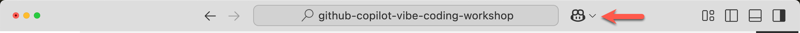
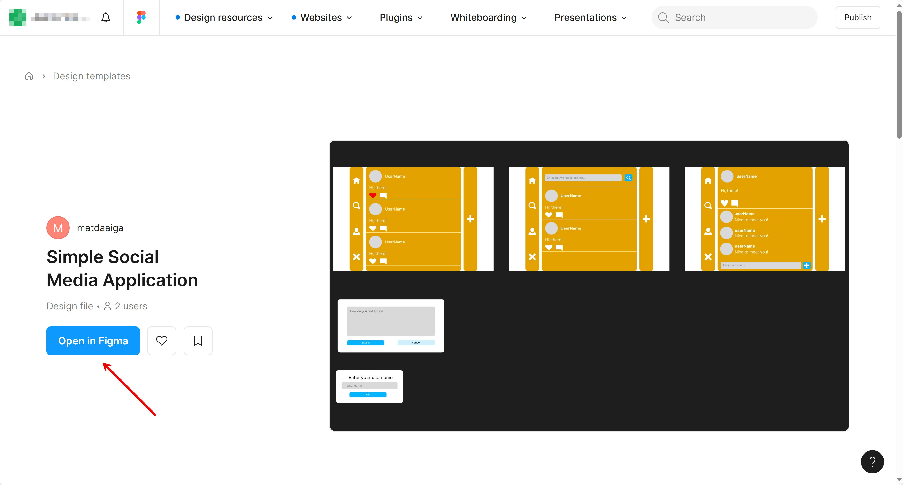

# 02: JavaScript Frontend Development - GitHub Codespace

## Scenario

Contoso is a company that sells products for various outdoor activities. A marketing department of Contoso would like to launch a micro social media website to promote their products for existing and potential customers.

As a JavaScript developer, you're going to build a JavaScript frontend app using React communicating to the Python backend API app.

## Prerequisites

- You should have a GitHub Codespace instance running (created from the [main repository](https://github.com/microsoft/github-copilot-vibe-coding-workshop))
- Refer to the [README](../README.md) doc for preparation
- Complete [STEP 00: Development Environment](./00-setup.md) if you haven't done so
- Complete [STEP 01: Python Backend Development](./01-python.md) if you haven't done so

## Getting Started

- [Check GitHub Copilot Agent Mode](#check-github-copilot-agent-mode)
- [Prepare Custom Instructions](#prepare-custom-instructions)
- [Prepare Application Project](#prepare-application-project)
- [Prepare Figma MCP Server](#prepare-figma-mcp-server)
- [Generate UI Components from Figma](#generate-ui-components-from-figma)
- [Run FastAPI Backend App](#run-fastapi-backend-app)
- [Build React Frontend App](#build-react-frontend-app)
- [Verify React Frontend App](#verify-react-frontend-app)

### Check GitHub Copilot Agent Mode

1. Click the GitHub Copilot icon on the top of GitHub Codespace and open GitHub Copilot window.

   

1. If you're asked to login or sign up, do it. It's free of charge.
1. Make sure you're using GitHub Copilot Agent Mode.

   

1. Select model to either `GPT-4.1` or `Claude Sonnet 4`.
1. Make sure that you've configured [MCP Servers](./00-setup.md#set-up-mcp-servers).

### Prepare Custom Instructions

1. Open a terminal in GitHub Codespace (Terminal → New Terminal).

1. Set the environment variable of `REPOSITORY_ROOT`.

   ```bash
   REPOSITORY_ROOT=$(git rev-parse --show-toplevel)
   ```

1. Copy custom instructions.

   ```bash
   cp -r $REPOSITORY_ROOT/docs/custom-instructions/javascript/. \
         $REPOSITORY_ROOT/.github/
   ```

### Prepare Application Project

1. Make sure that you're using GitHub Copilot Agent Mode with the model of `Claude Sonnet 4` or `GPT-4.1`.
1. Make sure that the `context7` MCP server is up and running.
   - Open Command Palette by typing F1 or `Ctrl`+`Shift`+`P` (or `Cmd`+`Shift`+`P` on Mac)
   - Search `MCP: List Servers`
   - Choose `context7` then click `Start Server` if it's not already running
1. Use prompt like below to scaffold a React web app project.

   ```text
   I'd like to scaffold a React web app. Follow the instructions below.
   
   - Make sure it's the web app, not the mobile app.
   - Your working directory is `javascript`.
   - Identify all the steps first, which you're going to do.
   - Use ViteJS as the frontend app framework.
   - Use default settings when initializing the project.
   - Use `SimpleSocialMediaApplication` as the name of the project while initializing.
   - Use the port number of `3000`.
   - Only initialize the project. DO NOT go further.
   ```

1. Click the  button of GitHub Copilot to take the changes.

### Prepare Figma MCP Server

1. Make sure that you've configured [MCP Servers](./00-setup.md#set-up-mcp-servers).
1. Get the personal access token (PAT) from [Figma](https://www.figma.com/).
   - Go to [Figma Settings](https://www.figma.com/settings)
   - Navigate to "Personal access tokens"
   - Generate a new token if you don't have one
1. Open Command Palette by typing F1 or `Ctrl`+`Shift`+`P` (or `Cmd`+`Shift`+`P` on Mac), and search `MCP: List Servers`.
1. Choose `Framelink Figma MCP` then click `Start Server`.
1. Enter the PAT you get issued from Figma when prompted.

### Generate UI Components from Figma

1. Make sure that you're using GitHub Copilot Agent Mode with the model of `Claude Sonnet 4` or `GPT-4.1`.
1. Make sure that you're running the Figma MCP server.
1. Copy the [Figma design template](https://www.figma.com/community/file/1495954632647006209) to your account.

   

1. Right-click each section - `Home`, `Search`, `Post Details`, `Post Modal` and `Name Input Modal` 👉 Select `Copy/Paste as` 👉 Select `Copy link to selection` to get the link to each section. Take note all five links.

### Run FastAPI Backend App

1. Make sure that the FastAPI backend app is up and running.

   ```text
   Run the FastAPI backend API, which is located at the `python` directory.
   ```

   > **NOTE**: You may use the [`complete/python`](../complete/python/) sample app instead.

1. **IMPORTANT for GitHub Codespace**: Configure port forwarding for the backend API.
   - Once the FastAPI app starts on port `8000`, GitHub Codespace will automatically detect it
   - Click on the "Ports" tab in the bottom panel of Codespace
   - Find port `8000` in the list
   - Right-click on port `8000` and select "Port Visibility" → "Public"
   - This is crucial! If the port is set to `private`, you'll get a `401` error when accessing from the frontend app

   > **NOTE**: In GitHub Codespace, ports are private by default. You must set port `8000` to public for the frontend to access the backend API.

### Build React Frontend App

1. Make sure that you're using GitHub Copilot Agent Mode with the model of `Claude Sonnet 4` or `GPT-4.1`.
1. Make sure that the `context7` MCP server is up and running.
1. Make sure that you have all the Figma section links of 5 retrieved from the [previous section](#generate-ui-components-from-figma).
1. Add [`product-requirements.md`](../product-requirements.md) and [`openapi.yaml`](../openapi.yaml) to GitHub Copilot.
   - In GitHub Copilot Chat, click the "+" button or use `@` to mention files
   - Add both files to the context
1. Use prompt like below to build the application based on the requirements and OpenAPI document.

   ```text
   I'd like to build a React web app. Follow the instructions below.
   
   - Your working directory is `javascript`.
   - Identify all the steps first, which you're going to do.
   - There's a backend API app running on `http://localhost:8000`.
   - Use `openapi.yaml` that describes all the endpoints and data schema.
   - Use the port number of `3000`.
   - Create all the UI components defined in this link: {{FIGMA_SECTION_LINK}}.
   - DO NOT add anything not related to the UI components.
   - DO NOT add anything not defined in `openapi.yaml`.
   - DO NOT modify anything defined in `openapi.yaml`.
   - Give visual indication when the backend API is unavailable or unreachable for any reason.
   ```

   > **NOTE**: Replace `{{FIGMA_SECTION_LINK}}` with one of the five Figma section links you copied earlier.

1. Repeat four more times for the rest four Figma design links (one link per prompt).
1. Click the  button of GitHub Copilot to take the changes after each step.

### Verify React Frontend App

1. Make sure that the FastAPI backend app is up and running.

   ```text
   Run the FastAPI backend API, which is located at the `python` directory.
   ```

1. Verify if it's built properly or not.

   ```text
   Run the React app and verify if the app is properly running.

   If app running fails, analyze the issues and fix them.
   ```

1. **Configure port forwarding for the frontend app in GitHub Codespace**:
   - Once the React app starts on port `3000`, GitHub Codespace will automatically detect it
   - Click on the "Ports" tab in the bottom panel of Codespace
   - Find port `3000` in the list
   - Right-click on port `3000` and select "Port Visibility" → "Public" (optional, but recommended for easier access)
   - Click on the globe icon or the URL to open the app in a new browser tab

1. Open a web browser and navigate to the forwarded URL (usually shown in the Ports tab, or you can click the globe icon next to port 3000).

   > **NOTE**: In GitHub Codespace, you don't use `http://localhost:3000` directly. Instead, use the forwarded URL provided by Codespace, which looks like `https://<workspace-name>-3000.<region>.app.github.dev`.

1. Verify if both frontend and backend apps are running properly:
   - The React app should load without errors
   - The app should be able to communicate with the backend API
   - Check the browser console for any errors
   - Test the functionality of the app

1. Click the `[keep]` button of GitHub Copilot to take the changes.

## Troubleshooting

### Port Access Issues

- **Problem**: Frontend can't connect to backend (401 error or CORS issues)
- **Solution**: 
  - Make sure port `8000` (backend) is set to **Public** in the Ports tab
  - Check that the backend API is actually running
  - Verify the API URL in your React app configuration

### MCP Server Not Starting

- **Problem**: MCP servers won't start
- **Solution**:
  - Make sure Docker is running (if required by the MCP server)
  - Check the MCP server configuration in `.vscode/settings.json`
  - Restart the Codespace if needed

### React App Won't Start

- **Problem**: React app fails to start or build
- **Solution**:
  - Check that Node.js is installed: `node --version`
  - Check that npm is installed: `npm --version`
  - Navigate to the `javascript` directory and check for errors
  - Try deleting `node_modules` and running `npm install` again

---

OK. You've completed the "JavaScript" step. Let's move onto [STEP 03: Java Migration from Python](./03-java.md).
