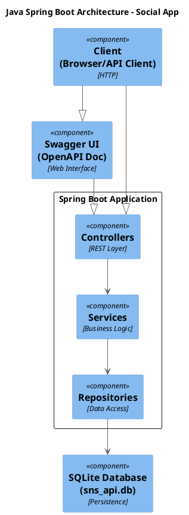
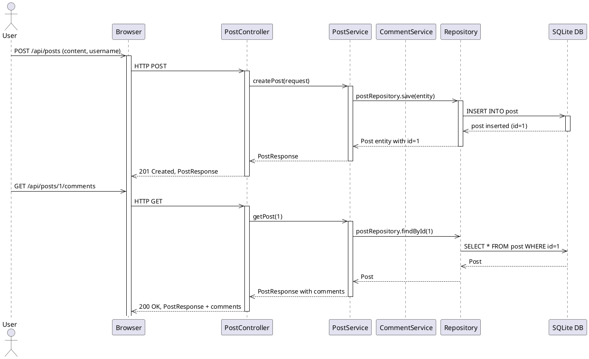
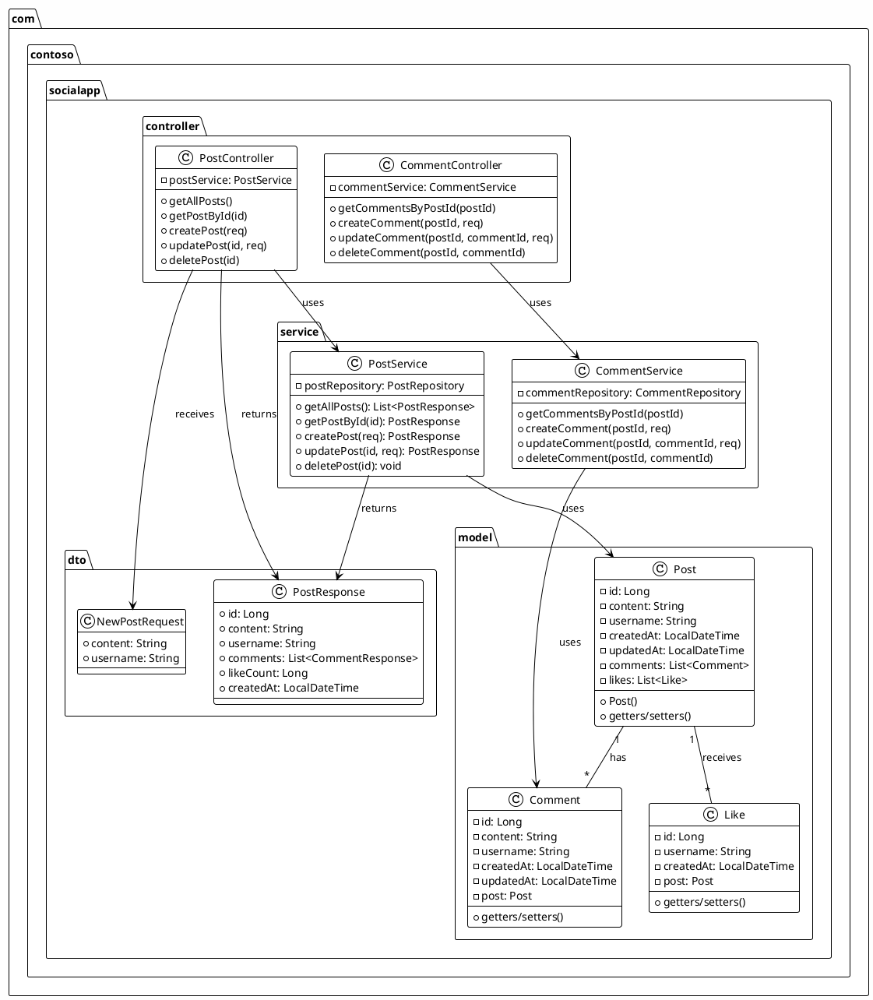
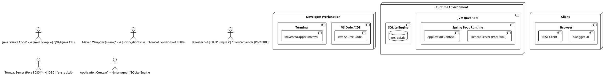
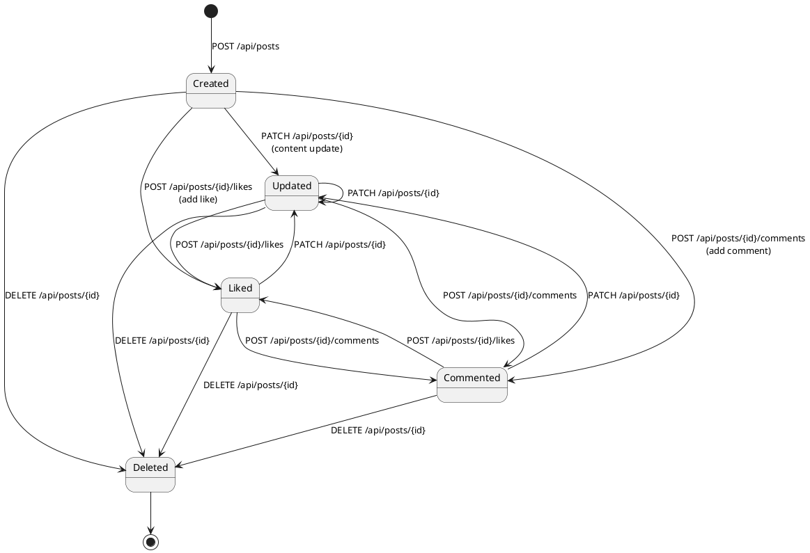
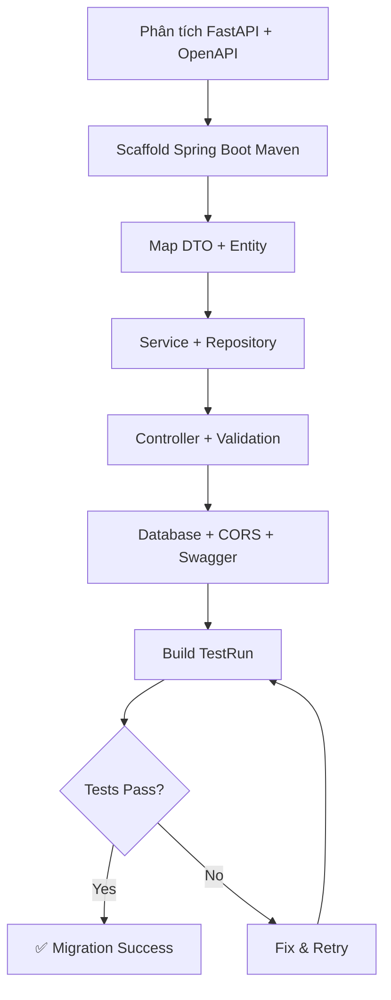
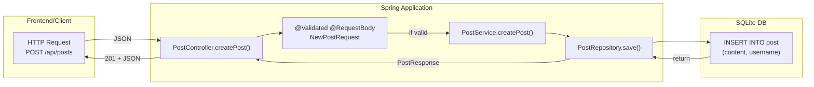

# PlantUML Diagrams - Java Migration Report
## Sử dụng: Copy code và paste vào https://www.planttext.com/ để render

---

## DIAGRAM 1: ARCHITECTURE - UML Component Diagram


---

## DIAGRAM 2: ENTITY RELATIONSHIP DIAGRAM (ERD)
```plantuml
@startuml erd
!define COLUMN(x) <color:#035><b>x</b></color>
!define TABLE(x) <color:#3d0><b>x</b></color>

entity "TABLE(Post)" {
    COLUMN(id) : Long << generated >>
    COLUMN(content) : String
    COLUMN(username) : String
    COLUMN(created_at) : LocalDateTime
    COLUMN(updated_at) : LocalDateTime
}

entity "TABLE(Comment)" {
    COLUMN(id) : Long << generated >>
    COLUMN(post_id) : Long << FK >>
    COLUMN(content) : String
    COLUMN(username) : String
    COLUMN(created_at) : LocalDateTime
    COLUMN(updated_at) : LocalDateTime
}

entity "TABLE(Like)" {
    COLUMN(id) : Long << generated >>
    COLUMN(post_id) : Long << FK >>
    COLUMN(username) : String
    COLUMN(created_at) : LocalDateTime
}

TABLE(Post) ||--o{ TABLE(Comment): has
TABLE(Post) ||--o{ TABLE(Like): receives

@enduml
```

---

## DIAGRAM 3: SEQUENCE DIAGRAM - USE CASE TAO POST CO COMMENT


---

## DIAGRAM 4: CLASS DIAGRAM - LAYER & RELATIONSHIP


---

## DIAGRAM 5: DEPLOYMENT DIAGRAM - RUNTIME ENVIRONMENT


---

## DIAGRAM 6: STATE DIAGRAM - POST LIFECYCLE


---

## DIAGRAM 7: MIGRATION PROCESS FLOW (Mermaid)


---

## DIAGRAM 8: CONTROLLER REQUEST FLOW (Mermaid)


---

## Hướng dẫn sử dụng

1. **Copy từng block code** (giữa ```plantuml ... ``` hoặc ```mermaid ... ```)
2. **Truy cập:** https://www.planttext.com/ (cho PlantUML)
3. **Paste code** vào editor
4. **Render ra PNG/SVG**
5. **Download và lưu** vào `docs/images/03-java/`

### Danh sách file hình ảnh cần lưu
- `diagram-1-architecture.png` - Component architecture
- `diagram-2-erd.png` - Entity relationship
- `diagram-3-sequence.png` - Create post with comments sequence
- `diagram-4-class.png` - All classes and relationships
- `diagram-5-deployment.png` - Runtime deployment
- `diagram-6-state.png` - Post lifecycle states
- `diagram-7-process.png` - Migration process flow
- `diagram-8-controller-flow.png` - Request flow trong controller

---

**Ghi chú:** Nếu muốn render Mermaid diagram, có thể sử dụng https://mermaid.live/ hoặc GitHub markdown preview.
